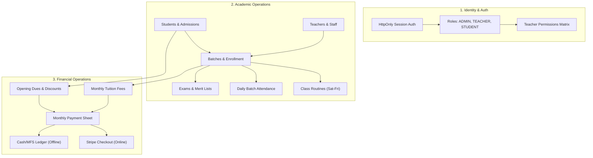
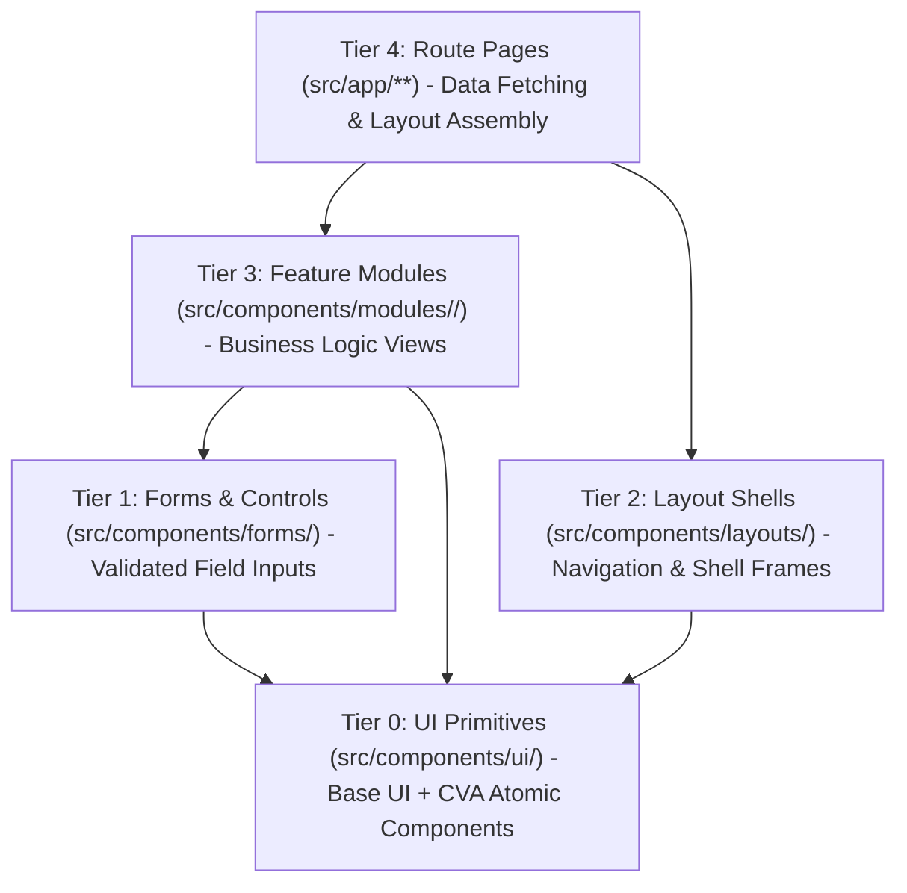

<!-- BEGIN:nextjs-agent-rules -->

# This is NOT the Next.js you know

This version has breaking changes — APIs, conventions, and file structure may all differ from your training data. Read the relevant guide in `node_modules/next/dist/docs/` (resolved from this file's directory; in monorepos the `next` package may not be visible from the repo root) before writing any code. Heed deprecation notices.

This block is written and re-added by `next dev` — verify at `node_modules/next/dist/server/lib/generate-agent-files.js`. Removing it from a diff only re-creates the uncommitted change; committing it with your work keeps the tree clean.

<!-- END:nextjs-agent-rules -->

# Agent Memory & Engineering Guidelines: Coaching Management System Frontend

This document serves as the permanent memory, architectural blueprint, and engineering standard for all AI agents and developers working on this codebase.

---

## 1. System Overview & Core Stack

- **Application Domain**: Coaching Center Management System (Multi-tenant/multi-instance coaching administration, student admissions, batch scheduling, attendance verification, exam grading, and fee collections).
- **Package Manager & Runtime**: `bun` (`bun@1.4.2`). Always use `bun` for installing dependencies and executing scripts.
- **Core Technology Matrix**:
  - **Framework**: Next.js 16.3.4 (App Router) + React 19.2.8
  - **Compiler**: React Compiler enabled (`reactCompiler: true` in `next.config.ts`)
  - **Styling**: Tailwind CSS v4 + `tw-animate-css` + Semantic OKLCH design tokens
  - **UI Primitives**: Base UI (`@base-ui/react`) + Shadcn (`base-nova` style) + Lucide Icons
  - **Data Fetching & Server State**: TanStack Query v5 (`@tanstack/react-query`) + `ofetch`
  - **Forms & Schema Validation**: `@tanstack/react-form` + `zod` (v4.6.2)
  - **Feedback & Notifications**: `react-hot-toast` + OKLCH token styling
  - **Linter & Formatter**: Biome 2.4.2 (`biome.json`)

---

## 2. Exhaustive Business Logic & Domain Architecture

The application model is structured into 8 core business domains that govern the coaching center's operational and academic life:



---

### 2.1 Domain 1: Authentication, Session Management & Server Routing Proxy

#### 1. Security Model & Token Strategy

- **HttpOnly Cookie Exclusivity**: All authentication tokens (`accessToken` with 15-minute lifespan, `refreshToken` with 30-day lifespan) are set and cleared by the backend exclusively via `Set-Cookie` with `HttpOnly`, `Secure`, `SameSite: Lax`.
- **Zero LocalStorage Storage**: Under no circumstances should authentication tokens be written to `localStorage`, `sessionStorage`, or window global variables.
- **HTTP Client Transport**: `ofetch` instance in `src/lib/api-client.ts` uses `credentials: "include"` on every request to pass cookies automatically.

#### 2. Silent Token Refresh & Concurrency Queuing

- When an API request receives an HTTP 401 (access token expired), `apiClient` prevents request cascading by running an atomic refresh loop:
  1. Sets `isRefreshing = true`.
  2. Enqueues all concurrent outgoing requests into an in-memory `failedQueue`.
  3. Executes `POST /auth/refresh-token` using the HttpOnly refresh cookie.
  4. Upon success, replays all queued promises with fresh cookies.
  5. Upon failure (401/403 from refresh endpoint), dispatches `auth:session-expired` and purges the queue.
- **Network Drop Resilience**: Network errors, 5xx server errors, or offline drops **must never** log out the user. Only explicit 401/403 authorization failures on the refresh route trigger a logout.

#### 3. Cross-Tab Synchronization (`BroadcastChannel`)

- Implemented in `src/lib/auth-channel.ts` via the `BroadcastChannel` API (`auth_channel`).
- Propagates `LOGIN`, `LOGOUT`, and `SESSION_EXPIRED` events instantly across all open browser tabs without requiring manual page reload.
- Listened to globally by `src/providers/auth-listener.tsx`.

#### 4. Next.js 16 Server-Side Routing Proxy (`src/proxy.ts`)

- In Next.js 16, `middleware.ts` is deprecated in favor of `src/proxy.ts`.
- Evaluates incoming server edge requests before page rendering:
  - Protects `/dashboard/:path*`: If neither `accessToken` nor `refreshToken` cookies exist, redirects to `/login?redirect=${pathname}${search}`.
  - Guards `/login` & `/forgot-password`: If auth cookies exist, redirects immediately to `/dashboard`.

#### 5. Smart Dashboard Gateway (`/dashboard`)

- The entry route `/dashboard/page.tsx` evaluates the authenticated `user.role` and redirects to the dedicated portal:
  - `ADMIN` $\rightarrow$ `/dashboard/admin`
  - `TEACHER` $\rightarrow$ `/dashboard/teacher`
  - `STUDENT` $\rightarrow$ `/dashboard/student`

---

### 2.2 Domain 2: Student Admissions & Lifecycle Management

#### 1. Admission Pipelines

- **Public Self-Registration (`/onboard-student`)**: Prospective students or parents submit an application creating a `PendingStudent` record with personal and academic metadata (`rollNumber`, `classLevel`, `institutionName`, `guardianName`, `guardianPhone`, `gender`).
- **Direct Admin Admission (`/auth/register-student`)**: Administrative staff enters student credentials directly for instant enrollment.

#### 2. Pending Application State Machine

- `PENDING` $\rightarrow$ Admin reviews application:
  - **Approve** (`PATCH /auth/pending-students/:id/approve`): Promotes application to an `ACTIVE` Student user account.
  - **Reject** (`PATCH /auth/pending-students/:id/reject`): Archives application with optional `rejectionReason`.

#### 3. User Status Lifecycle

- `PENDING_ACTIVATION` $\rightarrow$ `ACTIVE` $\leftrightarrow$ `INACTIVE` / `BLOCKED`.
- Status updates executed via `PATCH /users/:userId/status`.
- Soft deletion via `DELETE /users/:userId`.

---

### 2.3 Domain 3: Teacher Staff & Granular Permission Delegation

#### 1. Teacher Profile & Onboarding

- Admin registers teachers via `POST /auth/register-teacher`, capturing designation, educational qualification, subject specialization, and joining date.

#### 2. Granular Delegation Matrix

- Teachers operate within a scoped permission set (`TeacherPermission`):
  - `MANAGE_ATTENDANCE`: Allows viewing, taking, and modifying student daily attendance sheets.
  - `MANAGE_EXAMS`: Allows creating exams, entering bulk marks, and publishing results.
  - `MANAGE_ROUTINES`: Allows adding and modifying weekly timetable slots.
- UI elements (sidebar links, action buttons, dialogs) enforce permissions via the `hasPermission(permission)` helper from `useAuth()`.

#### 3. Daily Campus Check-In

- Teachers check in daily via `POST /attendance/teachers/check-in` (`TeacherSelfCheckInCard`).
- Admins can view teacher attendance sheets (`GET /attendance/teachers`) and mark bulk attendance (`POST /attendance/teachers/bulk`).

---

### 2.4 Domain 4: Academic Batches & Enrollment Workflows

#### 1. Batch State Lifecycle

- Batches represent academic groups with a defined monthly fee (`fee`) and status:
  - `UPCOMING`: Scheduled future batch, open for enrollment.
  - `ONGOING`: Active teaching in progress.
  - `COMPLETED`: Curriculum concluded.
  - `CANCELLED`: Discontinued batch.

#### 2. Dual Enrollment Streams

- **Student Self-Enrollment**: Student applies for a batch $\rightarrow$ creates a `BatchEnrollment` with `status = "PENDING"` $\rightarrow$ Admin approves (`/batches/enrollments/:id/approve`) or rejects (`/batches/enrollments/:id/reject`).
- **Direct Admin Enrollment**: Admin directly enrolls student via `POST /batches/:batchId/students` (`directEnrollStudent`), immediately setting status to `ENROLLED`.
- **Roster Management**: Batch roster inspection (`GET /batches/:batchId/students`) with student removal (`DELETE /batches/:batchId/students/:userId`).

---

### 2.5 Domain 5: Class Routines & Timetable Scheduling

#### 1. Academic Week Standard

- Timetables operate on a 7-day academic cycle: `SATURDAY`, `SUNDAY`, `MONDAY`, `TUESDAY`, `WEDNESDAY`, `THURSDAY`, `FRIDAY` (`ACADEMIC_DAYS_ORDER` in `src/types/routine-type.ts`).

#### 2. Slot Data Model & Constraints

- A `RoutineSlot` defines: `batchId`, `dayOfWeek`, `startTime` (e.g. `"10:00"`), `endTime` (e.g. `"11:30"`), `subject`, `room`, `teacherId`.
- Prevents teacher double-booking, room conflicts, and batch schedule overlaps.

#### 3. Perspectives & Exports

- **Batch Routine**: `/dashboard/admin/routines` (filtered by batch).
- **Teacher Routine**: `/dashboard/teacher/routines` (personal teaching schedule).
- **Student Combined Timetable**: `/dashboard/student/routines` (aggregated across all active enrollments).
- **PDF Export**: Direct PDF generation endpoint at `/routines/batches/:batchId/pdf?download=true`.

---

### 2.6 Domain 6: Batch Daily Attendance Sheets & Analytics

#### 1. Daily Attendance Taking

- Daily attendance sheets (`GET /attendance/batches/:batchId?date=YYYY-MM-DD`) display all enrolled students.
- Bulk submission (`POST /attendance/batches/:batchId`) with statuses:
  - `PRESENT` | `ABSENT` | `LATE` | `EXCUSED` | `LEAVE` + optional per-student remarks.
- Individual record updates via `PATCH /attendance/:attendanceId`.

#### 2. Metrics & Calculation Engine

- Automatically aggregates:
  $$\text{Attendance Rate (\%)} = \left( \frac{\text{Present Count} + \text{Late Count}}{\text{Total Enrolled Students}} \right) \times 100$$
- Student longitudinal attendance history available via `GET /attendance/students/:studentId` and `GET /attendance/my/summary`.

---

### 2.7 Domain 7: Exams, Grading, Merit Lists & Automated Gradebooks

#### 1. Exam Configuration & State Machine

- Created with `title`, `batchId`, `totalMarks`, `passMarks`, `examDate`.
- Lifecycle: `UPCOMING` $\rightarrow$ `ONGOING` $\rightarrow$ `COMPLETED` / `CANCELLED`.
- Result State: `DRAFT` (marks editable, hidden from students) $\rightarrow$ `PUBLISHED` (visible on student portals and public merit lists).

#### 2. Marks Entry & Automated Grade Calculation

- Bulk marks modal (`POST /exams/:examId/marks`) accepts marks obtained per student.
- Automated grade evaluation:
  - **Letter Grade**: `A+`, `A`, `A-`, `B`, `C`, `D`, `F`
  - **GPA**: `5.00`, `4.00`, `3.50`, `3.00`, `2.00`, `1.00`, `0.00`
  - **Pass Status**: $\text{Marks Obtained} \ge \text{Pass Marks}$
  - **Rank**: Position ordered by marks obtained descending within the batch.

#### 3. Merit List & Report Cards

- Batch Merit List (`GET /exams/:examId/results`) provides statistical summaries: highest mark, lowest mark, class average, pass percentage.
- Student Report Card PDF download (`/exams/:examId/students/:studentId/report-card/pdf`).
- Server-side email delivery (`POST /exams/:examId/students/:studentId/send-report-card`).

---

### 2.8 Domain 8: Tuition Billing, Invoicing & Dual Payment Channels

#### 1. Tuition Calculation & Arrears Formula

- For every student enrollment:
  $$\text{Effective Monthly Fee} = \text{Batch Base Fee} - \text{Discount Amount}$$
  $$\text{Total Payable Due} = \text{Effective Monthly Fee} + \text{Previous Months Due} - \text{Paid This Month}$$
- Opening arrears and monthly discounts configured via `PATCH /payments/enrollments/:enrollmentId/previous-dues`.

#### 2. Admin Monthly Payment Sheet (`GET /payments/monthly-sheet`)

- Aggregated financial ledger per month/year:
  - Total Expected Revenue
  - Total Collected Revenue
  - Total Outstanding Arrears
  - Paid Count, Partial Count, Unpaid Defaulters Count

#### 3. Dual Payment Methods

- **Online Checkout (Stripe)**: Student initiates session (`POST /payments/create-checkout-session`), redirected to Stripe hosted checkout, webhook confirms payment status to `COMPLETED`.
- **Offline Collection (Admin Manual)**: Admin records manual cash/MFS payment (`POST /payments/manual-collect`) with payment method (`CASH`, `BKASH`, `NAGAD`, `ROCKET`, `BANK_TRANSFER`), creating a signed payment receipt.
- **Receipts**: PDF receipts generated via `/payments/transactions/:transactionId/pdf`.

---

## 3. Directory Taxonomy & Architecture

```plaintext
src/
├── api/                  # Centralized HTTP endpoints (ofetch apiClient instances)
│   ├── attendance.ts     # Student & teacher attendance endpoints
│   ├── auth.ts           # Login, logout, refresh-token, session /users/me
│   ├── batches.ts        # Batches CRUD, student rosters, pending enrollments
│   ├── exam.ts           # Exams, bulk marks entry, merit lists, report cards
│   ├── payment.ts        # Stripe checkout, manual collection, monthly payment sheet
│   ├── routines.ts       # Routine slots, schedules, PDF exports
│   ├── students.ts       # Student admissions, profile management, pending queue
│   └── teachers.ts       # Teacher registrations, permissions, status updates
├── app/                  # Next.js 16 App Router (route groups, layouts, pages)
│   ├── (public)/         # Unauthenticated route groups
│   │   ├── (auth)/       # /login, /onboard-student, /forgot-password
│   │   └── (marketing)/  # Marketing landing pages, hero presentation
│   ├── dashboard/        # Protected management portal
│   │   ├── admin/        # Admin portal routes (students, teachers, batches, routines, exams, payments)
│   │   ├── teacher/      # Teacher workspace (batches, routines, attendance, exams)
│   │   ├── student/      # Student mobile-first portal (routines, attendance, exams, payments)
│   │   ├── layout.tsx    # Dashboard shell with dynamic sidebar and header
│   │   └── page.tsx      # Smart Gateway redirecting to role dashboard
│   ├── globals.css       # Tailwind CSS v4 @theme inline and semantic OKLCH tokens
│   ├── layout.tsx        # Root shell with font optimization, site metadata, AppProviders
│   └── proxy.ts          # Server-side routing proxy (Next.js 16 edge protection)
├── assets/               # Static vector graphics and reusable SVG components
├── components/           # 5-Tier Component Composition Hierarchy
│   ├── forms/            # Reusable validated form controls (@tanstack/react-form + zod)
│   ├── layouts/          # Header, Sidebar, Footer, and Dashboard Shell frames
│   ├── modules/          # Domain-bounded feature slices (attendance, batches, exams, etc.)
│   └── ui/               # Atomic Base UI + CVA primitives (button, card, dialog, table, etc.)
├── config/               # Centralized white-label brand identity (siteConfig)
├── constants/            # Navigation menus, query keys, academic day lists
├── hooks/                # Custom React hooks (useAuth, useBatches, useExams, useAttendance, etc.)
├── lib/                  # Utilities (cn class merger, ofetch apiClient, auth-channel BroadcastChannel)
├── providers/            # React Context providers (QueryClientProvider, ToastProvider, AuthListener)
├── types/                # Domain TypeScript models, DTOs, and API responses
└── validators/           # Zod validation schemas (v4) for forms and API payloads
```

---

## 4. 5-Tier Component Composition Hierarchy



1. **Tier 0: UI Primitives (`src/components/ui/`)**: Unstyled `@base-ui/react` primitives styled with `cva` and `cn`. Never created manually—installed via shadcn CLI.
2. **Tier 1: Forms & Fields (`src/components/forms/`)**: Validated controls powered by `@tanstack/react-form` + `zod`.
3. **Tier 2: Layout Shells (`src/components/layouts/`)**: Macro-structural headers, sidebars, footers, and dashboard containers.
4. **Tier 3: Feature Modules (`src/components/modules/<domain>/`)**: Self-contained domain views (tables, dialogs, ribbons, modal sheets) encapsulating business logic.
5. **Tier 4: Route Pages (`src/app/**`)\*\*: Thin server/client orchestrators assembling feature modules.

---

## 5. Universal Engineering & Coding Standards

### 5.1 Next.js 16 & React 19 Paradigms

- **Server-First Execution**: Default to React Server Components (RSC). Add `"use client"` only when components need browser APIs, state, effects, or user interactions.
- **React Compiler Active**: Because `reactCompiler: true` is configured in `next.config.ts`, do not manually wrap calculations in `useMemo` or callbacks in `useCallback` unless handling external imperative instances.
- **Async Page & Layout Parameters**: In Next.js 16, `params` and `searchParams` are Promises. Always await them:
  ```tsx
  export default async function Page({
    params,
    searchParams,
  }: {
    params: Promise<{ id: string }>;
    searchParams: Promise<{ [key: string]: string | string[] | undefined }>;
  }) {
    const { id } = await params;
    const query = await searchParams;
    // ...
  }
  ```
- **Thin Route Pages**: Route pages must not embed complex inline JSX tables or multi-hundred-line forms. Route files delegate to Tier 3 feature modules.

### 5.2 White-Labeling & Centralized Brand Configuration

- Never hardcode coaching center names, phone numbers, or logo URLs inside JSX.
- Always import `siteConfig` from `@/config/site`:

  ```tsx
  import { siteConfig } from "@/config/site";

  // Use in headers, sidebars, metadata, footers:
  <h1>{siteConfig.name}</h1>;
  ```

- Brand properties are overridable via `NEXT_PUBLIC_*` environment variables (`NEXT_PUBLIC_APP_NAME`, `NEXT_PUBLIC_LOGO_URL`, `NEXT_PUBLIC_SUPPORT_EMAIL`).

### 5.3 Data Fetching & Query Key Conventions

- All server queries and mutations use `@tanstack/react-query` v5.
- Centralize query key factories in `src/constants/query-keys.ts` or co-locate with query hooks to avoid stale cache bugs.
- Always handle cache invalidation on mutations (e.g. updating batch roster invalidates `BATCH_KEYS.detail(batchId)` and `BATCH_KEYS.students(batchId)`).

### 5.4 Form Handling & Zod Validation

- Interactive forms must use `@tanstack/react-form`.
- All schemas must be defined in `src/validators/` with `zod` (v4).
- Infer types from schemas (`export type LoginInput = z.infer<typeof loginSchema>`) and export them.

### 5.5 Notifications & Async Feedback

- Use `react-hot-toast` for user action feedback.
- For asynchronous operations, use the ID update pattern:
  ```tsx
  const toastId = toast.loading("Saving attendance records...");
  try {
    await mutation.mutateAsync(payload);
    toast.success("Attendance saved successfully!", { id: toastId });
  } catch (err) {
    toast.error(getErrorMessage(err), { id: toastId });
  }
  ```

### 5.6 TypeScript & Code Quality

- Strict typing (100% type safety, zero `any` types).
- Use path aliases `@/*` pointing to `src/*`.
- Biome is the sole linter and formatter. Never add ESLint or Prettier config files.

---

## 6. Mandatory Post-Task Code Quality Pipeline

Whenever you write, edit, or refactor any code in this repository, you **MUST** execute the following 3 commands in order:

```bash
# Step 1: Check Linter & Code Correctness
bun run lint

# Step 2: Auto-fix Linter & Import Sorting Issues
bun run lint:write

# Step 3: Format Code According to Repository Standards
bun run format
```
