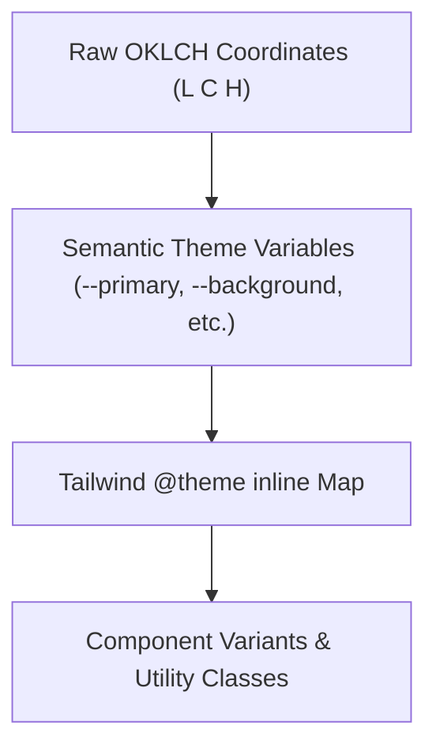
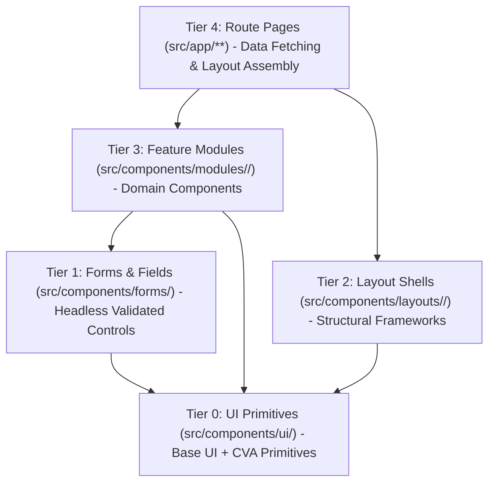

# Design System & UI Architecture Specification

This document defines the generic design system, token architecture, component composition hierarchy, and UI/UX conventions governing the entire application.

---

## 1. Core Design Philosophy

- **Token-Driven Architecture**: All visual properties (colors, radiuses, shadows, typography) are derived from semantic CSS custom properties rather than hardcoded utility classes.
- **Perceptual Color Precision (OKLCH)**: Utilizes the OKLCH color space for consistent lightness, uniform contrast ratios, and seamless light/dark mode transitions.
- **Centralized Brand Decoupling (White-Labeling)**: All identity strings, logos, titles, and metadata are centralized in `src/config/site.ts`, allowing instant rebranding across all pages and deployments without code modifications.
- **Headless Primitives + Deterministic Styling**: UI primitives are built upon unstyled, accessible foundation components (`@base-ui/react`) and styled using `class-variance-authority` (`cva`).
- **Composition Over Inheritance**: Complex UI patterns are assembled by composing atomic primitives, headless form handlers, and domain-bounded feature modules.
- **Accessibility (a11y) First**: WAI-ARIA compliance, visible focus indicators (`ring`), keyboard navigation, and semantic HTML elements across all components.

---

## 2. Design Token Taxonomy & Color System

All visual tokens are defined in `src/app/globals.css` using Tailwind CSS v4 `@theme inline` and semantic OKLCH color variables.

### 2.1 Semantic Token Layers



- **Surface & Canvas**:
  - `--background` / `--foreground`: Base canvas and high-contrast text.
  - `--card` / `--card-foreground`: Elevated surface containers (cards, panels).
  - `--popover` / `--popover-foreground`: Floating overlays (menus, tooltips, dialogs).
- **Brand & Action**:
  - `--primary` / `--primary-foreground`: Primary action elements, active highlights, key CTAs.
  - `--secondary` / `--secondary-foreground`: Auxiliary actions, pill badges, secondary surfaces.
  - `--accent` / `--accent-foreground`: Interactive hover states and subtle emphasis.
- **Feedback & Utility**:
  - `--muted` / `--muted-foreground`: De-emphasized surfaces, placeholders, and secondary text.
  - `--destructive`: Errors, destructive operations, validation warnings.
  - `--border` / `--input`: Structural dividers, panel boundaries, and input outlines.
  - `--ring`: Focus indicators for keyboard navigation and active element focus.
- **App Shell / Dashboard Namespace**:
  - `--sidebar*`: Isolated semantic tokens for dashboard navigation containers, active item indicators, and section borders.

### 2.2 Elevation & Border Radius Matrix

- **Base Radius**: Configured via `--radius` (`0.45rem`).
- **Modular Radius Scale**:
  - `sm`: `calc(var(--radius) * 0.6)`
  - `md`: `calc(var(--radius) * 0.8)`
  - `lg`: `var(--radius)`
  - `xl`: `calc(var(--radius) * 1.4)`
  - `2xl`: `calc(var(--radius) * 1.8)`
  - `3xl`: `calc(var(--radius) * 2.2)`
  - `4xl`: `calc(var(--radius) * 2.6)`

---

## 3. Typography Hierarchy & Font Mapping

Typography is managed through Next.js Font Optimization and mapped to CSS variables:

| Token Variable      | Role / Application                                 | Characteristics                        |
| :------------------ | :------------------------------------------------- | :------------------------------------- |
| `--font-heading`    | Display headings, section titles, hero banners     | High legibility, structural prominence |
| `--font-sans`       | Primary UI body, interactive controls, form fields | Clean, neutral sans-serif              |
| `--font-geist-sans` | Metrics, statistical counters, tabular figures     | Modern proportional geometric sans     |
| `--font-geist-mono` | Code snippets, technical tokens, identifiers       | Monospaced, fixed-width clarity        |

---

## 4. Centralized Brand Configuration (White-Label Standard)

All consumer components across the application must consume brand identity through `src/config/site.ts`:

```typescript
// Example usage in navigation, headers, and dashboard shells:
import { siteConfig } from "@/config/site";

// Display brand name dynamically
const brandTitle = siteConfig.name;
const logoUrl = siteConfig.logo.src;
```

**Rule for Developers & Agents**: Never hardcode client or coaching center names in JSX. Always reference `siteConfig` to guarantee multi-deployment compatibility.

---

## 5. Component Layering & Composition Model

The codebase enforces a strict 5-tier component composition hierarchy:



### 5.1 Tier 0: UI Primitives (`src/components/ui/`)

- Atomic, generic, domain-agnostic UI building blocks (buttons, dialogs, dropdowns, inputs, badges).
- Built on unstyled `@base-ui/react` primitives.
- Exposes clean variant APIs via `class-variance-authority` (`cva`).
- Merges dynamic class names strictly via `cn(...)` utility.

### 5.2 Tier 1: Forms & Controls (`src/components/forms/`)

- Reusable form fields, input groups, and composite form components.
- Powered by `@tanstack/react-form` for state and validated against `zod` schemas.
- Integrates error messaging, dirty state tracking, and accessible field labels.

### 5.3 Tier 2: Layout Shells (`src/components/layouts/`)

- Macro-structural containers providing navigation headers, sidebars, footers, and app framing.
- Encapsulates responsive drawer toggles, breadcrumb bars, and user menu dropdowns.

### 5.4 Tier 3: Feature Modules (`src/components/modules/<feature-domain>/`)

- Business-logic-rich, domain-specific UI sections (e.g., dashboard data tables, landing sections, onboarding workflows).
- Assembles primitives, forms, and layout components into cohesive functional blocks.

### 5.5 Tier 4: Route Pages (`src/app/**`)

- Thin page orchestrators responsible for data prefetching, route parameter resolution, and rendering Tier 3 feature modules.

---

## 6. Generic Layout Archetypes

The application supports three structural page archetypes:

### 6.1 Public Marketing Archetype

- **Structure**: Full-height vertical flow (`min-h-screen flex flex-col`).
- **Composition**: Global Navigation Header $\rightarrow$ Fluid Content Area (`<main className="flex-1">`) $\rightarrow$ Global Footer.
- **Context**: Marketing pages, product information, public documentation.

### 6.2 Minimal / Conversion Archetype (Auth & Onboarding)

- **Structure**: Centered, distraction-free container with constrained max-width (`max-w-md` to `max-w-lg`).
- **Composition**: Centered Card Surface $\rightarrow$ Accessible Form Fields $\rightarrow$ Secondary Action Links.
- **Context**: Login, registration, password recovery, multi-step onboarding flows.

### 6.3 Administrative & Teacher Dashboard Archetype (Unified Shell)

- **Structure**: Two-tier responsive layout with a persistent/collapsible left sidebar, top utility bar, and scrollable content canvas.
- **Left Sidebar Navigation**:
  - Semantic `--sidebar*` tokens for background, border, active state, and text.
  - Supports 3 responsive modes: Full expanded, collapsed icon-only rail, and slide-in mobile drawer.
  - Reusable between Admin and Teacher roles with dynamic navigation filtering based on role and permissions.
- **Top Utility Header**:
  - Fixed or sticky bar containing breadcrumbs, sidebar collapse toggle, quick search, notification trigger, and user profile/status pill.
- **Scrollable Data Viewport**:
  - Fluid `<main>` area hosting Tier 3 feature modules (data grids, metrics cards, filter bars, mutation modals).
- **Context**: Admin management operations, teacher academic routines, grading, attendance tracking.

### 6.4 Student Portal Archetype (Mobile-First)

- **Structure**: Highly responsive, touch-first mobile layout with optional bottom navigation tab bar or quick-access drawer.
- **Focus**: Instant glanceability of upcoming batches, class routines, attendance summary, exam results, and fee payment receipts.
- **Context**: Student self-service and guardian monitoring.

---

## 7. Interaction, Feedback & State Conventions

1. **State Feedback**: Interactive elements must support explicit `hover`, `active`, `focus-visible`, `disabled`, and `aria-invalid` states.
2. **Toast Notifications**: System feedback for async operations (loading, success, error) is presented via `react-hot-toast`, styled with semantic OKLCH variables (`--card`, `--border`, `--destructive`, `--primary`).
3. **Skeleton & Loading States**: Asynchronous data views must render layout-matching skeleton placeholders rather than generic spinners.
4. **Empty & Error States**: Data collections must provide clear, actionable fallback interfaces for empty datasets and network failures.
5. **Responsive Strategy**: Mobile-first layout progression using standard responsive breakpoints (`sm:`, `md:`, `lg:`, `xl:`, `2xl:`).
