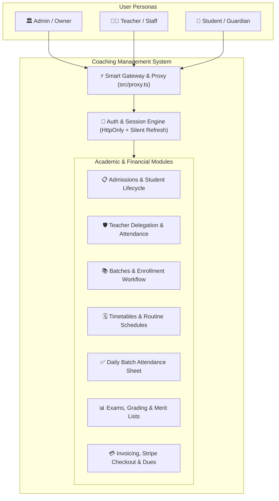

# 🎓 Coaching Management System (CMS) — Frontend

[](https://nextjs.org/)
[](https://react.dev/)
[](https://tailwindcss.com/)
[](https://tanstack.com/query)
[](https://biomejs.dev/)
[](https://bun.sh/)

An enterprise-grade, multi-tenant/multi-instance frontend application built with **Next.js 16 (App Router)** and **React 19** for managing coaching centers, academic institutions, and tutoring academies.

Designed for high-concurrency environments, multi-branch scalability, white-label branding, and modern role-based educational workflows.

---

## 🌟 Executive Overview & Business Value

Running a modern coaching center demands synchronization across disparate operational domains: student admissions, teacher scheduling, batch enrollments, daily physical presence verification, exam grading, merit list publishing, and monthly fee collections.

This application provides a unified, real-time command center for administrators, teachers, and students with zero latency, accessible interfaces, and deterministic state synchronization.



---

## 💼 Core Business Logic & Functional Domains

### 1. 🔐 Authentication, Session Lifecycle & Multi-Persona Gateway

- **Zero-Storage Token Security**: All JWT authentication tokens (`accessToken` with 15-minute validity, `refreshToken` with 30-day validity) are managed strictly via HttpOnly cookies sent with `credentials: "include"`. Zero tokens are stored in `localStorage` or `sessionStorage`.
- **Edge Route Protection (`src/proxy.ts`)**: Next.js 16 server-side routing proxy executes on the server before pages are evaluated, preventing route flicker and redirecting unauthenticated traffic to `/login?redirect=...`.
- **Silent Refresh & Concurrency Queuing**: When access tokens expire, `apiClient` intercepts the 401 response and initiates an atomic `POST /auth/refresh-token` call. Concurrent client requests are held in a memory queue (`failedQueue`) and replayed upon successful token renewal.
- **Cross-Tab Synchronization**: Uses the browser `BroadcastChannel` API (`auth_channel`) to immediately propagate `LOGIN`, `LOGOUT`, and `SESSION_EXPIRED` events across all active browser tabs.
- **Dynamic Gateway Dispatcher**: The root `/dashboard` route evaluates the authenticated user's role and redirects immediately to the role-specific workspace:
  - `ADMIN` $\rightarrow$ `/dashboard/admin`
  - `TEACHER` $\rightarrow$ `/dashboard/teacher`
  - `STUDENT` $\rightarrow$ `/dashboard/student`

---

### 2. 📋 Student Lifecycle & Admissions Workflow

- **Dual Admission Channels**:
  1. _Public Self-Registration_: Prospective students apply online via `/onboard-student`, entering academic profile details (institution, grade level, roll number, guardian contacts). The system generates a `PENDING` admission application.
  2. _Direct Administrative Registration_: Center staff registers verified students directly via `/auth/register-student`.
- **Application Review & Approval Pipeline**: Administrators review pending applications from a centralized queue, with one-click actions to `APPROVE` (activating the account) or `REJECT` (with custom rejection reasoning).
- **Status State Machine**: Students progress through lifecycle states: `PENDING_ACTIVATION` $\rightarrow$ `ACTIVE` $\leftrightarrow$ `INACTIVE` / `BLOCKED`.
- **Dossier & Academic Record**: Complete student profile includes guardian contacts, institutional enrollment, batch histories, attendance ratios, exam report cards, and balance ledgers.

---

### 3. 👨‍🏫 Teacher Management & Granular Permission Delegation

- **Staff Onboarding**: Direct administrative registration (`/auth/register-teacher`) capturing educational qualifications, subject specializations, designation, and joining date.
- **Granular Permission Matrix**: Administrators delegate specific operational capabilities to teachers on a per-instructor basis:
  - `MANAGE_ATTENDANCE`: Grants access to mark and edit student daily attendance sheets for assigned batches.
  - `MANAGE_EXAMS`: Grants access to create exams, input marks, and publish batch gradebooks.
  - `MANAGE_ROUTINES`: Grants access to create and modify timetable class schedules.
- **Teacher Self Check-In**: Teachers perform daily campus check-ins with single-click check-in logging and optional notes (`/attendance/teachers/check-in`).
- **Staff Attendance Tracking**: Administrative bulk attendance marking and individual monthly attendance performance statistics.

---

### 4. 📚 Academic Batches & Enrollment Streams

- **Batch Hierarchy & Capacity**: Batches represent specific classroom groups with custom monthly fee schedules, target grade levels, and status tracking (`UPCOMING`, `ONGOING`, `COMPLETED`, `CANCELLED`).
- **Dual Enrollment Architecture**:
  - _Student Self-Enrollment Request_: Students browse open batches and apply for enrollment, entering the admin `PendingEnrollments` approval queue.
  - _Administrative Direct Enrollment_: Administrators assign any active student directly to batches with immediate roster enrollment.
- **Batch Student Roster**: Comprehensive batch overview with student contact information, guardian details, and one-click student removal/drop actions.

---

### 5. 🗓️ Class Routines & Conflict-Free Scheduling

- **Standard Academic Week Schedule**: Seven-day timetable structure running Saturday through Friday (`SATURDAY`, `SUNDAY`, `MONDAY`, `TUESDAY`, `WEDNESDAY`, `THURSDAY`, `FRIDAY`).
- **Slot Conflict Validation**: Room, teacher, and batch slot assignments preventing double-booking overlaps.
- **Multi-Perspective Timetable Views**:
  - _Batch Routine_: Weekly classroom schedule for a selected batch.
  - _Teacher Timetable_: Instructor-centric weekly teaching schedule.
  - _Student Combined Schedule_: Unified weekly calendar showing all classes across all batches the student is enrolled in.
- **Print & PDF Generation**: Native print modal and direct server-side PDF generation endpoint (`/routines/batches/:batchId/pdf`).

---

### 6. ✅ Daily Batch Attendance Sheet & Analytics

- **Batch-Wide Daily Attendance Grid**: Interactive attendance sheet allowing teachers and admins to mark status for all enrolled students in a batch for any calendar date:
  - `PRESENT` | `ABSENT` | `LATE` | `EXCUSED` | `LEAVE`
- **Real-Time Attendance Metrics**: Automatic computation of present count, absence count, late arrivals, excused leaves, and overall batch attendance rate percentage.
- **Individual Attendance Summaries**: Longitudinal attendance history logs, monthly presence rates, and session logs for both students and teachers.

---

### 7. 📊 Exams, Grading, Merit Lists & Report Cards

- **Exam Configuration**: Batch-specific exams with title, total marks, pass marks, and schedule date.
- **Draft vs. Published Workflow**:
  - Marks can be entered and modified in `DRAFT` state without student visibility.
  - When marked `PUBLISHED`, results become accessible on student dashboards and merit lists.
- **Bulk Marks Entry & Automated Grading**:
  - Rapid spreadsheet-like marks input modal for all examinees.
  - Automated calculation of letter grade, GPA points, pass/fail status, and batch class rank.
- **Batch Merit List**: Complete statistical ribbon (highest mark, lowest mark, class average, pass percentage) and ranked student leaderboard.
- **Report Card PDF & Email Dispatch**:
  - Downloadable official student report card PDF (`/exams/:examId/students/:studentId/report-card/pdf`).
  - One-click server-side email dispatch of PDF report cards directly to student/guardian emails.

---

### 8. 💳 Tuition Billing, Invoicing & Dual-Channel Payments

- **Monthly Billing Cycle & Discount Engine**:
  - Batches define baseline monthly fees.
  - Individual enrollments support recurring monthly discounts (`discountAmount`) and historical opening arrears (`openingDue`).
  - Effective monthly payable amount = $\text{Batch Fee} - \text{Discount} + \text{Prior Dues}$.
- **Admin Monthly Payment Sheet**:
  - Real-time institutional financial spreadsheet for any billing month/year.
  - Computes total expected revenue, total collected revenue, total outstanding arrears, paid count, partial payment count, and unpaid defaulters count.
- **Dual Payment Channels**:
  1. _Online Self-Checkout (Stripe)_: Students initiate Stripe Checkout sessions (`/payments/create-checkout-session`) with automatic currency conversion and immediate status reconciliation.
  2. _Offline Manual Collection (Cash / Bank / MFS)_: Administrators record manual payments (Cash, bKash, Nagad, Rocket, Bank Transfer) with receipt note logging.
- **Financial Ledger & Receipts**: Complete audit trail of all transactions with downloadable PDF payment receipts.

---

## 👥 Role & Permissions Matrix

| Module / Feature                     |      Admin       | Teacher (Default) | Teacher (With Permission) |     Student     |
| :----------------------------------- | :--------------: | :---------------: | :-----------------------: | :-------------: |
| **View Dashboard Metrics**           |   Full Center    | Assigned Batches  |     Assigned Batches      |  Personal Only  |
| **Manage Students & Admissions**     |   Full Access    |     No Access     |         No Access         |  Self Profile   |
| **Manage Teachers & Permissions**    |   Full Access    |     No Access     |         No Access         |    No Access    |
| **Create & Edit Batches**            |   Full Access    |   View Assigned   |       View Assigned       | Browse Batches  |
| **Enroll Students in Batches**       | Direct / Approve |     No Access     |         No Access         | Apply for Batch |
| **Class Timetable Scheduling**       |   Full Access    |   View Schedule   |     `MANAGE_ROUTINES`     |  View Enrolled  |
| **Mark Daily Student Attendance**    |   Full Access    |     View Only     |    `MANAGE_ATTENDANCE`    |  View Personal  |
| **Teacher Self Check-In**            |     Mark All     |     Check-In      |         Check-In          |    No Access    |
| **Create Exams & Enter Marks**       |   Full Access    |     View Only     |      `MANAGE_EXAMS`       |  View Results   |
| **Publish / Unpublish Exam Results** |   Full Access    |     View Only     |      `MANAGE_EXAMS`       |    No Access    |
| **Dispatch Report Card Emails**      |   Full Access    |     No Access     |      `MANAGE_EXAMS`       |    No Access    |
| **Monthly Payment Sheet & Dues**     |   Full Access    |     No Access     |         No Access         |  View Personal  |
| **Manual Cash Payment Collection**   |   Full Access    |     No Access     |         No Access         |    No Access    |
| **Online Stripe Tuition Payment**    |    No Access     |     No Access     |         No Access         |  Self Checkout  |
| **Download PDF Receipts / Reports**  |   Full Access    |   Batch Reports   |       Batch Reports       |  Personal Only  |

---

## 🏗️ Architecture & Technology Matrix

| Layer                  | Technology                                      | Rationale & Capabilities                                                                                           |
| :--------------------- | :---------------------------------------------- | :----------------------------------------------------------------------------------------------------------------- |
| **Framework**          | **Next.js 16.3.4 (App Router)**                 | Server-First rendering, React Server Components (RSC), route groups, streaming, and server edge proxies.           |
| **UI Library**         | **React 19.2.8**                                | Modern React primitives with concurrent transitions, Actions, and enhanced hooks.                                  |
| **Compiler**           | **React Compiler (Babel Plugin)**               | Automated memoization (`reactCompiler: true`), eliminating manual `useMemo` and `useCallback` boilerplate.         |
| **Styling**            | **Tailwind CSS v4 + tw-animate-css**            | Modern `@theme inline` design tokens, OKLCH perceptual lightness color spaces, high-contrast dark theme variables. |
| **UI Primitives**      | **Base UI (`@base-ui/react`) + Shadcn**         | Unstyled, accessible, robust headless UI primitives styled via `class-variance-authority` (CVA).                   |
| **Server State**       | **TanStack Query v5 (`@tanstack/react-query`)** | Client caching, query deduplication, optimistic mutations, window focus refetching, and key factories.             |
| **Form Management**    | **TanStack Form (`@tanstack/react-form`)**      | Headless, high-performance form state management with zero unnecessary re-renders.                                 |
| **Validation**         | **Zod (v4.6.2)**                                | Schema validation, type inference (`z.infer<T>`), and form error boundary enforcement.                             |
| **HTTP Client**        | **ofetch (v1.5.1)**                             | Lightweight, auto-parsing HTTP client with interceptors for seamless HttpOnly token refresh.                       |
| **Notifications**      | **react-hot-toast**                             | Async promise toasts (loading $\rightarrow$ success/error) styled with semantic OKLCH theme tokens.                |
| **Linter / Formatter** | **Biome (v2.4.2)**                              | Single, ultra-fast Rust-based linter and code formatter. Zero ESLint/Prettier conflicts.                           |
| **Package Manager**    | **Bun (v1.4.2)**                                | High-speed JavaScript package manager and runtime.                                                                 |

---

## 📁 Directory Taxonomy

```plaintext
coaching-management-system-frontend/
├── src/
│   ├── api/                     # Centralized API service contracts using apiClient (ofetch)
│   │   ├── attendance.ts        # Student & teacher attendance endpoints
│   │   ├── auth.ts              # Login, logout, refresh, and current user session calls
│   │   ├── batches.ts           # Batch CRUD, student rosters, and pending enrollments
│   │   ├── exam.ts              # Exams, bulk marks entry, merit lists, report cards
│   │   ├── payment.ts           # Stripe sessions, manual fee collection, monthly payment sheet
│   │   ├── routines.ts          # Weekly timetable slots, teacher schedules, PDF downloads
│   │   ├── students.ts          # Student admissions, profile updates, pending queue
│   │   └── teachers.ts          # Teacher registration, permission updates, status toggle
│   ├── app/                     # Next.js App Router (route groups and layouts)
│   │   ├── (public)/            # Public unauthenticated routes
│   │   │   ├── (auth)/          # /login, /onboard-student, /forgot-password
│   │   │   └── (marketing)/     # Landing page, public presentation, hero section
│   │   ├── dashboard/           # Protected dashboard layout and smart gateway
│   │   │   ├── admin/           # Admin portal (students, teachers, batches, routines, exams, payments)
│   │   │   ├── teacher/         # Teacher workspace (batches, routines, attendance, exams)
│   │   │   └── student/         # Student mobile-first portal (routines, attendance, exams, payments)
│   │   ├── globals.css          # Tailwind CSS v4 @theme inline and semantic OKLCH tokens
│   │   └── layout.tsx           # Root layout with fonts, metadata, and AppProviders
│   ├── assets/                  # Scalable vector graphics and static assets
│   ├── components/              # 5-Tier Component Composition Hierarchy
│   │   ├── forms/               # Validated form inputs and field controls
│   │   ├── layouts/             # Dashboard header, responsive sidebar, public header, footer
│   │   ├── modules/             # Domain feature modules (attendance, batches, exams, routines, students, teachers)
│   │   └── ui/                  # Atomic Base UI + CVA primitives (button, card, dialog, table, badge, etc.)
│   ├── config/                  # Centralized white-label brand configuration (siteConfig)
│   ├── constants/               # Navigation menus, query keys, academic day enumerations
│   ├── hooks/                   # Custom React hooks (useAuth, useBatches, useExams, useAttendance, etc.)
│   ├── lib/                     # Utilities (cn class merger, ofetch apiClient, auth-channel BroadcastChannel)
│   ├── providers/               # Context providers (QueryClientProvider, ToastProvider, AuthListener)
│   ├── proxy.ts                 # Next.js 16 server routing proxy (replaces legacy middleware)
│   ├── types/                   # TypeScript domain models, DTOs, and API responses
│   └── validators/              # Zod validation schemas (auth, student, teacher, batch, exam, payment, routine)
├── AGENTS.md                    # Persistent memory, architectural blueprint, and agent engineering standard
├── DESIGN.md                    # Design system specification, OKLCH tokens, and component hierarchy
├── package.json                 # Dependency definitions and scripts
└── biome.json                   # Biome linter and formatter configuration
```

---

## 🎨 White-Label & Multi-Instance Configuration

The entire application is decoupled from hardcoded branding and coaching center names. Application identity is centrally driven by `src/config/site.ts` and can be customized per deployment via environment variables without touching source code:

```env
NEXT_PUBLIC_APP_NAME="Apex Academy Coaching"
NEXT_PUBLIC_APP_SHORT_NAME="Apex Academy"
NEXT_PUBLIC_APP_TAGLINE="Excellence in Academic Coaching & Guidance"
NEXT_PUBLIC_APP_DESCRIPTION="Premier coaching management portal for admissions, classes, and results."
NEXT_PUBLIC_LOGO_URL="/branding/apex-logo.svg"
NEXT_PUBLIC_SUPPORT_EMAIL="contact@apexacademy.edu"
NEXT_PUBLIC_API_URL="http://localhost:5000/api/v1"
```

---

## 🚀 Getting Started

### 1. Prerequisites

- Install [Bun](https://bun.sh/) (v1.4.2 or later).
- Node.js environment (v20+ recommended for tooling compatibility).

### 2. Installation

```bash
bun install
```

### 3. Environment Setup

Create a `.env.local` file in the root directory:

```bash
cp .env.example .env.local
```

Configure your backend API base URL:

```env
NEXT_PUBLIC_API_URL="http://localhost:5000/api/v1"
```

### 4. Running the Development Server

```bash
bun run dev
```

Open [http://localhost:3000](http://localhost:3000) in your browser.

---

## 🧪 Code Quality & Build Scripts

This codebase uses **Biome** as its sole linter and formatter:

- `bun run dev` — Start the local Next.js development server with Turbopack.
- `bun run build` — Compile and bundle the production application.
- `bun run start` — Run the compiled production build.
- `bun run lint` — Execute Biome linter checks.
- `bun run lint:write` — Automatically fix linting and import sorting issues.
- `bun run format` — Apply consistent code formatting across the repository.

---

## 📚 Technical Documentation & References

- [AGENTS.md](./AGENTS.md) — Comprehensive engineering guidelines, agent memory, domain state machines, and technical protocols.
- [DESIGN.md](./DESIGN.md) — Visual design tokens, OKLCH color dynamics, component composition hierarchy, and layout archetypes.
