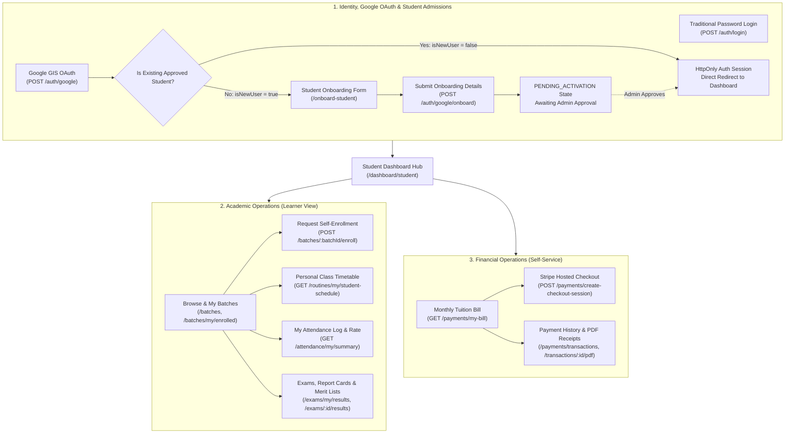
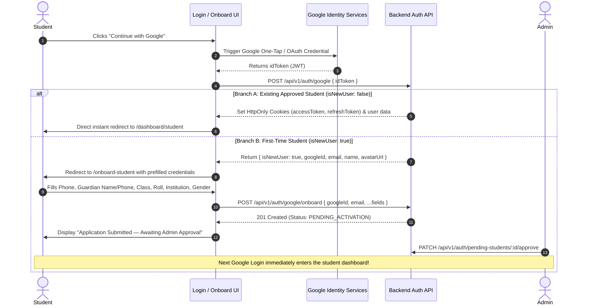

# System Feature Implementation Matrix: Student Role

> **Document Scope: STUDENT ROLE ONLY**  
> **Source of Truth: Postman Collection (`Coaching Center Management System API.postman_collection.json`)**  
> _Note: Administrative features are documented in `FEATURE_LIST_ADMIN.md`, and Teacher features are documented in `FEATURE_LIST_TEACHER.md`._

---

## Executive Summary (Student Role)

| Metric                                                          | Count  | Percentage |
| :-------------------------------------------------------------- | :----: | :--------: |
| **Total Student-Relevant Endpoints in Postman Collection**      | **38** |    100%    |
| **Fully Implemented Features (API + Hooks + Dedicated UI)**     | **14** | **36.8%**  |
| **API Ready / Hook Ready (Pending Dedicated Student UI Route)** | **20** | **52.6%**  |
| **Unimplemented / Backlog Endpoints & Client Flows**            | **4**  | **10.5%**  |

---

## 1. Domain Architecture & Student Operational Model

The Student Portal represents the learner and guardian-facing layer of the Coaching Center Management System. It is engineered for **mobile-first, high-accessibility, and self-service transparency**:



---

## 2. Google Identity Services (GIS) & Student Onboarding Pipeline

The student registration and onboarding architecture is strictly governed by Google OAuth and an administrative approval workflow:

### 2.1 The Two-Tier Authentication & Onboarding Sequence



### 2.2 Endpoint 1: Google ID Token Verification (`POST /api/v1/auth/google`)

- **Trigger**: Clicked "Continue with Google" on `/login` or `/onboard-student`.
- **Payload**:
  ```json
  {
    "idToken": "google_identity_services_credential_jwt"
  }
  ```
- **Response Branches**:
  - **Branch A (Existing Active Student)**:

    ```json
    {
      "success": true,
      "message": "Login successful",
      "data": {
        "isNewUser": false,
        "user": {
          "id": "uuid",
          "name": "Tanvir Ahmed",
          "email": "tanvir@gmail.com",
          "role": "STUDENT",
          "status": "ACTIVE",
          "studentProfile": {
            "rollNumber": "105",
            "classLevel": "Class 10",
            "institutionName": "Dhaka City College"
          }
        }
      }
    }
    ```

    _Action_: Sets user in TanStack Query cache, notifies `BroadcastChannel` (`LOGIN`), redirects to `/dashboard/student`.

  - **Branch B (First-Time Student)**:
    ```json
    {
      "success": true,
      "message": "User needs onboarding",
      "data": {
        "isNewUser": true,
        "googleId": "109823719827364589211",
        "email": "new.student@gmail.com",
        "name": "Tanvir Ahmed",
        "avatarUrl": "https://lh3.googleusercontent.com/a/..."
      }
    }
    ```
    _Action_: Saves temporary Google identity in state / sessionStorage, routes student to `/onboard-student`.

### 2.3 Endpoint 2: Student Onboarding (`POST /api/v1/auth/google/onboard`)

- **Trigger**: Student completes the academic & guardian registration form on `/onboard-student`.
- **Payload**:
  ```json
  {
    "googleId": "109823719827364589211",
    "email": "new.student@gmail.com",
    "name": "Tanvir Ahmed",
    "phone": "+8801812345678",
    "guardianName": "Rafiqul Ahmed",
    "guardianPhone": "+8801812345679",
    "institutionName": "Dhaka City College",
    "classLevel": "Class 10",
    "rollNumber": "105",
    "avatarUrl": "https://lh3.googleusercontent.com/a/...",
    "gender": "MALE"
  }
  ```
- **Lifecycle Outcome**:
  - Account created with status: `PENDING_ACTIVATION`.
  - Appears immediately under the Admin portal's **Pending Admissions Queue** (`GET /auth/pending-students`).
  - Student is presented with a persistent confirmation card: _"Your admission application is currently under review by the administration. You will be able to access your student portal as soon as it is approved."_

---

## 3. Implemented Student Features & APIs

The following capabilities are actively functional in the codebase (**API Client** $\rightarrow$ **TanStack Query Hooks** $\rightarrow$ **UI Components & Pages**).

### 3.1 Authentication & Session Management

- **Student Authentication**: `POST /auth/login`
  - HttpOnly cookie token management (`accessToken` & `refreshToken`).
  - Managed via `src/api/auth.ts`, `src/hooks/use-auth.ts`, and `/login`.
- **Silent Token Refresh**: `POST /auth/refresh-token`
  - Handled via `ofetch` interceptor in `src/lib/api-client.ts`.
- **Session Logout**: `POST /auth/logout`
  - Purges cookies, broadcasts cross-tab logout via `BroadcastChannel`, and updates UI state.
- **Current Student Profile Query**: `GET /users/me`
  - Retrieves authenticated student profile: `rollNumber`, `classLevel`, `institutionName`, `guardianName`, `guardianPhone`, `gender`.

### 3.2 Google OAuth & Student Onboarding (`/onboard-student`)

- **Google OAuth Authentication**: `POST /auth/google`
  - Powered by `@react-oauth/google` with global `GoogleOAuthProvider` and standard `<GoogleLogin />` button.
  - Direct login redirect for existing approved students (`isNewUser: false`).
- **Student Onboarding Admission Pipeline**: `POST /auth/google/onboard`
  - Prefilled verified Google identity (email, name, avatar).
  - Validated multi-step form capturing phone, guardian contact, class level, roll number, institution name, and gender.
  - Transitions applicant into `PENDING_ACTIVATION` state awaiting admin approval.
- **Route Protection & Security Guards**:
  - Client Guard in `student-onboarding-form.tsx`: Verifies `pending_google_user` session; unverified visitors are immediately redirected to `/` with toast feedback.
  - Server Edge Proxy in `src/proxy.ts`: Prevents already-authenticated users with active cookies from accessing `/onboard-student`.
  - Next.js Image optimization configuration for `lh3.googleusercontent.com` and `*.googleusercontent.com` avatars.

### 3.3 Batches & Self-Enrollment (`/dashboard/student/batches`)

- **Authenticated Student Batches**: `GET /batches/my/enrolled`
  - Fetches student's enrolled courses with statuses (`ENROLLED`, `APPROVED`, `PENDING`, `REJECTED`), fee information, and enrollment timestamps.
  - Queried via `useMyEnrolledBatches()` hook with automatic cache invalidation.
- **Batch Catalog & Course Exploration**: `GET /batches`
  - Explorable catalog with search filtering and status toggles (`Ongoing`, `Upcoming`).
  - Queried via `useSuspenseBatches()` hook, cross-referenced with `enrollmentMap` to identify enrollment states.
- **Self-Enrollment Application Workflow**: `POST /batches/:batchId/enroll`
  - Student initiates self-enrollment via `RequestEnrollmentDialog`, which confirms batch details, monthly fee in Bengali Taka (`৳`), and review expectations.
  - Automatically transitions enrollment to `PENDING` state and queues for administrator approval.
  - Re-apply workflow allows students with rejected applications to quickly submit a new enrollment request.
- **Dedicated Route & Suspense Architecture**:
  - Route `/dashboard/student/batches` with route-level `loading.tsx` and `<StudentBatchesSkeleton />` fallback.
  - Clean tab navigation between "My Batches" and "Explore Catalog" with responsive empty state and quick routing to class routines and tuition payments.

### 3.4 Tuition Billing, Stripe Checkout & PDF Receipts (`/dashboard/student/payments`)

- **Student Monthly Bill Calculation**: `GET /payments/my-bill?month=X&year=YYYY`
  - Real-time tuition ledger displaying base fee, discounts, opening arrears, total payable, and net balance.
- **Online Stripe Checkout**: `POST /payments/create-checkout-session`
  - Initiates Stripe hosted checkout session URL for instant card/online payment.
- **Student Payment Transactions Ledger**: `GET /payments/transactions`
  - Filterable list of student transactions (`STRIPE`, `CASH`, `BKASH`, `NAGAD`).
- **Payment Receipt PDF Download**: `GET /payments/transactions/:id/pdf`
  - Automated PDF invoice and payment receipt download modal.

### 3.5 Student Dashboard Gateway (`/dashboard/student`)

- **Smart Gateway Navigation**:
  - `/dashboard/page.tsx` evaluates `user.role === "STUDENT"` and redirects to `/dashboard/student`.
- **Welcome Hero Banner**:
  - Welcomes student with roll number, class level, institution, and quick navigation cards to routines, batches, attendance, exams, and payments.

---

## 4. API Ready / Hook Ready Features (Pending Dedicated Student UI Routes)

The following capabilities have backend endpoints, API client functions, and TanStack Query hooks in place, but need dedicated presentation pages inside `/dashboard/student/*`:

### 4.1 Class Routines & Personal Timetable (`/dashboard/student/routines`)

- `GET /routines/my/student-schedule` $\rightarrow$ `getMyStudentSchedule()` in `api/routines.ts`, `useMyStudentSchedule()` in `hooks/use-routines.ts`.
- `GET /routines/batch/:batchId` $\rightarrow$ `getBatchTimetable()`, `useBatchTimetable()`.
- `GET /routines/batches/:batchId/pdf` $\rightarrow$ `getBatchRoutinePdfUrl()`.
- **Needed**: A responsive 7-day academic weekly timetable grid (Saturday to Friday) with today's classes highlight and PDF routine export.

### 4.2 Attendance Tracking & Record Log (`/dashboard/student/attendance`)

- `GET /attendance/my/summary?page=1&limit=20` $\rightarrow$ `getMyStudentAttendanceSummary()` in `api/attendance.ts`, `useMyStudentAttendanceSummary()` in `hooks/use-attendance.ts`.
- **Needed**: Attendance health ribbon (% rate vs minimum threshold), metric counter cards (Working Days, Present, Late, Absent, Leaves), and chronological check-in table.

### 4.3 Exams, Results & Report Cards (`/dashboard/student/exams`)

- `GET /exams` $\rightarrow$ `getExams()`, `useExams()`.
- `GET /exams/my/results` $\rightarrow$ `getMyExamResults()`, `useMyExamResults()`.
- `GET /exams/my/results/:examId` $\rightarrow$ `getMySingleExamResult()`, `useMySingleExamResult()`.
- `GET /exams/:examId/results` $\rightarrow$ `getBatchExamResults()`, `useBatchExamResults()`.
- `GET /exams/:examId/students/:studentId/report-card/pdf` $\rightarrow `getReportCardPdfUrl()`.
- **Needed**: Academic performance summary (GPA, total exams, pass rate), exam results table with grade badges and batch rank (`#1 / 45`), report card modal, and 1-click PDF download.

### 4.4 Student Profile & Settings (`/dashboard/student/settings`)

- `PATCH /users/me` $\rightarrow$ `updateMyProfile()`, `useUpdateMyProfileMutation()`.
- `PATCH /users/change-password` $\rightarrow$ `changePassword()`, `useChangePasswordMutation()`.
- `PATCH /users/me/avatar` & `DELETE /users/me/avatar` $\rightarrow$ `uploadMyAvatar()`, `deleteMyAvatar()`.
- `GET /auth/sessions` & `POST /auth/logout-all` $\rightarrow$ `getActiveSessions()`, `useLogoutAllMutation()`.
- **Needed**: Student profile card (personal & guardian contact), avatar upload/remove, password change form, and active session manager.

---

## 5. Backlog / Unimplemented Features & APIs

The following endpoints require new client methods in `src/api` and `src/hooks`:

### 5.1 My Enrolled Batches Query

- **Endpoint**: `GET /api/v1/batches/my/enrolled`
- **Missing Client Functions**:
  - `getMyEnrolledBatches()` in `src/api/batches.ts`
  - `useMyEnrolledBatches()` in `src/hooks/use-batches.ts`

### 5.2 Student Self-Enrollment Request

- **Endpoint**: `POST /api/v1/batches/:batchId/enroll`
- **Missing Client Functions**:
  - `requestBatchEnrollment(batchId)` in `src/api/batches.ts`
  - `useRequestBatchEnrollmentMutation()` in `src/hooks/use-batches.ts`

### 5.3 Google OAuth & Onboarding Methods

### 5.3 Google OAuth & Onboarding Methods — ✅ COMPLETED

- **Endpoints**: `POST /api/v1/auth/google` & `POST /api/v1/auth/google/onboard`
- **Missing Client Functions**:
- **Completed Assets**:
  - `verifyGoogleToken({ idToken })` in `src/api/auth.ts`
  - `submitGoogleOnboarding(payload)` in `src/api/auth.ts`
  - `useGoogleAuthMutation()` & `useGoogleOnboardingMutation()` in `src/hooks/use-auth.ts`
  - `GoogleLoginButton` in `src/components/forms/google-login-button.tsx` (integrated into `/login`)
  - `StudentOnboardingForm` on `/onboard-student` with prefilled profile, validation, and confirmation screen

---

## 6. Comprehensive Student Endpoints Traceability Table (Postman Aligned)

|   #    | Postman Endpoint Name                      | Endpoint URL                                         |  Method  |      Status      | Frontend Implementation File                                            |
| :----: | :----------------------------------------- | :--------------------------------------------------- | :------: | :--------------: | :---------------------------------------------------------------------- |
| **1**  | `Root System Health`                       | `/health`                                            |  `GET`   |    🟢 Backend    | System health probe                                                     |
| **2**  | `API v1 Health`                            | `/api/v1/health`                                     |  `GET`   |    🟢 Backend    | API v1 health probe                                                     |
| **5**  | `Login — Student`                          | `/api/v1/auth/login`                                 |  `POST`  | 🟢 **COMPLETED** | `src/app/(public)/(auth)/login`                                         |
| **6**  | `Refresh Access Token`                     | `/api/v1/auth/refresh-token`                         |  `POST`  | 🟢 **COMPLETED** | `src/lib/api-client.ts` (Automatic silent loop)                         |
| **7**  | `Forgot Password`                          | `/api/v1/auth/forgot-password`                       |  `POST`  | 🟢 **COMPLETED** | `src/app/(public)/(auth)/forgot-password`                               |
| **8**  | `Reset Password`                           | `/api/v1/auth/reset-password`                        |  `POST`  | 🟢 **COMPLETED** | `src/app/(public)/(auth)/reset-password`                                |
| **9**  | `Logout`                                   | `/api/v1/auth/logout`                                |  `POST`  | 🟢 **COMPLETED** | Header User Menu & `useAuth()`                                          |
| **10** | `Logout from All Devices`                  | `/api/v1/auth/logout-all`                            |  `POST`  |   🟡 API Ready   | `ActiveSessionsCard` on `/dashboard/student/settings`                   |
| **11** | `List Active Login Sessions`               | `/api/v1/auth/sessions`                              |  `GET`   |   🟡 API Ready   | `ActiveSessionsCard` on `/dashboard/student/settings`                   |
| **14** | `Google ID Token Verification & Login`     | `/api/v1/auth/google`                                |  `POST`  |  🔴 **BACKLOG**  | Pending GIS Client + `verifyGoogleToken` API                            |
| **15** | `Google Student Onboarding`                | `/api/v1/auth/google/onboard`                        |  `POST`  |  🔴 **BACKLOG**  | Pending `/onboard-student` Form + API Integration                       |
| **14** | `Google ID Token Verification & Login`     | `/api/v1/auth/google`                                |  `POST`  | 🟢 **COMPLETED** | `GoogleLoginButton` in `login-form.tsx` & `useGoogleAuthMutation()`     |
| **15** | `Google Student Onboarding`                | `/api/v1/auth/google/onboard`                        |  `POST`  | 🟢 **COMPLETED** | `StudentOnboardingForm` on `/onboard-student` & `useGoogleOnboarding()` |
| **19** | `Get Institution Profile & Stats`          | `/api/v1/institution`                                |  `GET`   |   🟡 API Ready   | `src/api/institution.ts` $\rightarrow$ `useInstitutionProfile()`        |
| **21** | `Get Current User Profile (/me)`           | `/api/v1/users/me`                                   |  `GET`   | 🟢 **COMPLETED** | `useAuth()` in `src/hooks/use-auth.ts`                                  |
| **22** | `Update Current User Profile (/me)`        | `/api/v1/users/me`                                   | `PATCH`  |   🟡 API Ready   | `StudentProfileCard` on `/dashboard/student/settings`                   |
| **23** | `Change Password`                          | `/api/v1/users/change-password`                      | `PATCH`  |   🟡 API Ready   | `ChangePasswordCard` on `/dashboard/student/settings`                   |
| **32** | `Get All Batches (QueryBuilder)`           | `/api/v1/batches`                                    |  `GET`   |   🟡 API Ready   | `src/api/batches.ts` $\rightarrow$ `useBatches()`                       |
| **33** | `Get Batch Details by ID`                  | `/api/v1/batches/:batchId`                           |  `GET`   |   🟡 API Ready   | `src/api/batches.ts` $\rightarrow$ `useBatch()`                         |
| **36** | `Student Request Self-Enrollment`          | `/api/v1/batches/:batchId/enroll`                    |  `POST`  |  🔴 **BACKLOG**  | Pending in `src/api/batches.ts` & `src/hooks/use-batches.ts`            |
| **43** | `Get My Enrolled Batches`                  | `/api/v1/batches/my/enrolled`                        |  `GET`   |  🔴 **BACKLOG**  | Pending in `src/api/batches.ts` & `src/hooks/use-batches.ts`            |
| **45** | `Get All Routines (QueryBuilder)`          | `/api/v1/routines`                                   |  `GET`   |   🟡 API Ready   | `src/api/routines.ts` $\rightarrow$ `useRoutines()`                     |
| **46** | `Get Routine Slot by ID`                   | `/api/v1/routines/:routineId`                        |  `GET`   |   🟡 API Ready   | `src/api/routines.ts` $\rightarrow$ `useRoutine()`                      |
| **47** | `Get Batch Timetable (Day-Wise Grouped)`   | `/api/v1/routines/batch/:batchId`                    |  `GET`   |   🟡 API Ready   | `src/api/routines.ts` $\rightarrow$ `useBatchTimetable()`               |
| **50** | `Get My Class Timetable (Student Only)`    | `/api/v1/routines/my/student-schedule`               |  `GET`   |   🟡 API Ready   | `src/api/routines.ts` $\rightarrow$ `useMyStudentSchedule()`            |
| **53** | `Download Batch Routine Schedule PDF`      | `/api/v1/routines/batches/:batchId/pdf`              |  `GET`   |   🟡 API Ready   | `src/api/routines.ts` $\rightarrow$ `getBatchRoutinePdfUrl()`           |
| **58** | `Get My Attendance Summary (Student)`      | `/api/v1/attendance/my/summary`                      |  `GET`   |   🟡 API Ready   | `src/api/attendance.ts` $\rightarrow$ `useMyStudentAttendanceSummary()` |
| **66** | `Get Exams List (All Roles)`               | `/api/v1/exams`                                      |  `GET`   |   🟡 API Ready   | `src/api/exam.ts` $\rightarrow$ `useExams()`                            |
| **67** | `Get Single Exam Details (All Roles)`      | `/api/v1/exams/:examId`                              |  `GET`   |   🟡 API Ready   | `src/api/exam.ts` $\rightarrow$ `useExamDetails()`                      |
| **72** | `Get Batch Exam Results / Merit List`      | `/api/v1/exams/:examId/results`                      |  `GET`   |   🟡 API Ready   | `src/api/exam.ts` $\rightarrow$ `useBatchExamResults()`                 |
| **74** | `Get My Report Card (Student Only)`        | `/api/v1/exams/my/results`                           |  `GET`   |   🟡 API Ready   | `src/api/exam.ts` $\rightarrow$ `useMyExamResults()`                    |
| **75** | `Get My Single Exam Result (Student Only)` | `/api/v1/exams/my/results/:examId`                   |  `GET`   |   🟡 API Ready   | `src/api/exam.ts` $\rightarrow$ `useMySingleExamResult()`               |
| **77** | `Download Student Report Card PDF`         | `/api/v1/exams/:examId/students/:id/report-card/pdf` |  `GET`   |   🟡 API Ready   | `src/api/exam.ts` $\rightarrow$ `getReportCardPdfUrl()`                 |
| **79** | `Upload My Avatar (All Roles)`             | `/api/v1/users/me/avatar`                            | `PATCH`  |   🟡 API Ready   | `src/api/media.ts` $\rightarrow$ `useUploadMyAvatarMutation()`          |
| **80** | `Delete My Avatar (All Roles)`             | `/api/v1/users/me/avatar`                            | `DELETE` |   🟡 API Ready   | `src/api/media.ts` $\rightarrow$ `useDeleteMyAvatarMutation()`          |
| **85** | `Get Student Billing Summary & Dues`       | `/api/v1/payments/my-bill`                           |  `GET`   | 🟢 **COMPLETED** | `src/components/modules/payments/student-payment-view.tsx`              |
| **86** | `Create Stripe Checkout Session`           | `/api/v1/payments/create-checkout-session`           |  `POST`  | 🟢 **COMPLETED** | `src/components/modules/payments/student-payment-view.tsx`              |
| **87** | `Stripe Payment Webhook`                   | `/api/v1/payments/webhook`                           |  `POST`  |    🟢 Backend    | Server-to-server webhook handler                                        |
| **88** | `Get Payment Transactions Ledger`          | `/api/v1/payments/transactions`                      |  `GET`   | 🟢 **COMPLETED** | `src/components/modules/payments/student-payment-view.tsx`              |
| **89** | `Download Payment Receipt PDF`             | `/api/v1/payments/transactions/:id/pdf`              |  `GET`   | 🟢 **COMPLETED** | `src/components/modules/payments/student-payment-view.tsx`              |

---

## 7. TypeScript Data Models & Contract Specifications

### 7.1 Google Auth & Student Onboarding Contracts

```typescript
export interface GoogleAuthPayload {
  idToken: string;
}

export interface GoogleAuthResponseData {
  isNewUser: boolean;
  user?: User;
  tokens?: AuthTokens;
  googleId?: string;
  email?: string;
  name?: string;
  avatarUrl?: string;
}

export interface GoogleOnboardDto {
  googleId: string;
  email: string;
  name: string;
  phone: string;
  guardianName: string;
  guardianPhone: string;
  institutionName: string;
  classLevel: string;
  rollNumber: string;
  avatarUrl?: string | null;
  gender: "MALE" | "FEMALE" | "OTHER";
}
```

### 7.2 Student Academic & Schedule Models

```typescript
export interface StudentScheduleGroup {
  dayOfWeek:
    | "SATURDAY"
    | "SUNDAY"
    | "MONDAY"
    | "TUESDAY"
    | "WEDNESDAY"
    | "THURSDAY"
    | "FRIDAY";
  slots: {
    id: string;
    batchId: string;
    batchName: string;
    subject: string;
    startTime: string; // "10:00"
    endTime: string; // "11:30"
    room: string;
    teacherName?: string;
  }[];
}

export interface StudentAttendanceSummary {
  stats: {
    totalWorkingDays: number;
    presentDays: number;
    lateDays: number;
    absentDays: number;
    leaveDays: number;
    attendanceRate: number;
  };
  history: {
    id: string;
    date: string;
    checkInTime?: string | null;
    status: "PRESENT" | "LATE" | "ABSENT" | "EXCUSED" | "LEAVE";
    remarks?: string | null;
  }[];
}

export interface StudentExamReport {
  examId: string;
  title: string;
  batchName: string;
  examDate: string;
  totalMarks: number;
  passMarks: number;
  marksObtained: number;
  letterGrade: string; // "A+", "A", etc.
  gradePoint: number; // 5.00
  isPassed: boolean;
  rankInBatch: number;
  totalStudentsInBatch: number;
}
```

---

## 8. Strategic Roadmap: 7-Phase Implementation Plan

```mermaid
flowchart LR
    P1["Phase 1: Google OAuth & Onboarding\n(Login & /onboard-student)"] --> P2["Phase 2: Batches & Self-Enrollment\n(/dashboard/student/batches)"]
    P2 --> P3["Phase 3: Class Routines\n(/dashboard/student/routines)"]
    P3 --> P4["Phase 4: Attendance History\n(/dashboard/student/attendance)"]
    P4 --> P5["Phase 5: Exams & Report Cards\n(/dashboard/student/exams)"]
    P5 --> P6["Phase 6: Profile & Settings\n(/dashboard/student/settings)"]
    P6 --> P7["Phase 7: Real-Time Dashboard Hub\n(/dashboard/student)"]
```



|    Phase    | Module Name                              | Scope & Key Deliverables                                                                                                                                                                                                                                                                                                                 | Endpoints Involved                                                                                                             |
| :---------: | :--------------------------------------- | :--------------------------------------------------------------------------------------------------------------------------------------------------------------------------------------------------------------------------------------------------------------------------------------------------------------------------------------- | :----------------------------------------------------------------------------------------------------------------------------- |
| **Phase 1** | **Google OAuth & Student Onboarding** ✅ | • `@react-oauth/google` provider & `<GoogleLogin />` integration<br>• Seamless direct login for approved students<br>• Protected `/onboard-student` route with automatic redirect for unverified guests<br>• Multi-step admission form with Google identity prefill<br>• Account enters `PENDING_ACTIVATION` state awaiting admin review | `POST /auth/google`<br>`POST /auth/google/onboard`<br>`GET /users/me`                                                          |
| **Phase 2** | **Batches & Self-Enrollment** ✅         | • Implement `getMyEnrolledBatches` & `requestBatchEnrollment`<br>• Enrolled batches grid with monthly fee, status badges, & routine links<br>• Course catalog with 1-click self-enrollment request dialog & re-apply workflows                                                                                                           | `GET /batches/my/enrolled`<br>`POST /batches/:batchId/enroll`<br>`GET /batches`                                                |
| **Phase 3** | **Class Routine & Schedule**             | • 7-day responsive academic timetable grid<br>• Today's classes highlight filter<br>• Batch routine timetable modal & PDF schedule download                                                                                                                                                                                              | `GET /routines/my/student-schedule`<br>`GET /routines/batch/:batchId`<br>`GET /routines/batches/:batchId/pdf`                  |
| **Phase 4** | **Attendance Tracking**                  | • Monthly attendance metrics (Working days, Present, Late, Absent)<br>• Overall attendance compliance rate bar<br>• Chronological check-in log table with remarks                                                                                                                                                                        | `GET /attendance/my/summary`                                                                                                   |
| **Phase 5** | **Exams, Results & Merit Lists**         | • Published report cards with marks, letter grade, GPA, and rank<br>• Single exam detail modal with performance breakdown<br>• Official report card PDF download & class merit list viewer                                                                                                                                               | `GET /exams/my/results`<br>`GET /exams/my/results/:examId`<br>`GET /exams/:examId/results`<br>`GET /exams/.../report-card/pdf` |
| **Phase 6** | **Settings & Profile**                   | • Student academic & personal info card<br>• Avatar upload/remove integration<br>• Password change form & active sessions manager                                                                                                                                                                                                        | `GET /users/me`<br>`PATCH /users/me`<br>`PATCH /users/me/avatar`<br>`PATCH /users/change-password`<br>`GET /auth/sessions`     |
| **Phase 7** | **Real-Time Dashboard Hub**              | • Upgrade `/dashboard/student/page.tsx` with live data ribbons<br>• Today's scheduled classes widget<br>• Dues notification banner with quick Stripe checkout CTA                                                                                                                                                                        | Aggregated overview across all student queries                                                                                 |

---

## 9. Architecture & Code Quality Standards

1. **Strict Client-Side Boundary**:
   - Zero access or modifications to `coaching-management-system-backend`. All developments must remain strictly within `coaching-management-system-frontend`.
2. **React 19 & Next.js 16 Suspense-First Loading**:
   - Zero inline `if (isLoading)` guards in presentation components.
   - All async data slices must be wrapped with `<Suspense fallback={<FeatureSkeleton />}>` and TanStack Query hooks.
3. **Strict Path Aliasing & Centralized Config**:
   - Use `@/*` imports and `siteConfig` from `@/config/site`.
4. **Mandatory Post-Task Quality Pipeline**:
   ```bash
   bun run lint:write
   bun run format
   bun run lint
   bun run build
   ```
