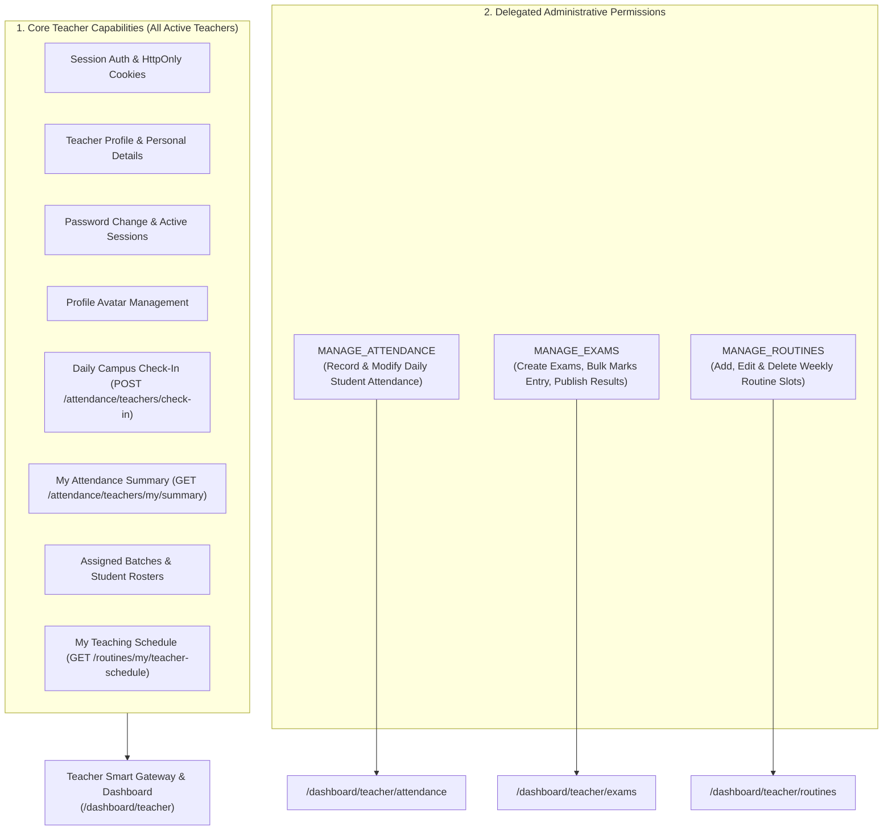

# System Feature Implementation Matrix: Teacher Role

> **Document Scope: TEACHER ROLE ONLY**  
> **Source of Truth: Postman Collection (`Coaching Center Management System API.postman_collection.json`)**  
> _Note: Administrative features are documented in `FEATURE_LIST_ADMIN.md`, and Student features will be documented in `FEATURE_LIST_STUDENT.md`._

---

## Executive Summary (Teacher Role)

| Metric                                                         | Count  | Percentage |
| :------------------------------------------------------------- | :----: | :--------: |
| **Total Teacher-Relevant Endpoints in Postman Collection**     | **44** |    100%    |
| **Fully Implemented Features (API + Hooks + UI)**              | **24** | **54.5%**  |
| **API Ready / Component Ready (Pending Dedicated Teacher UI)** | **11** | **25.0%**  |
| **Unimplemented / Backlog Features & APIs**                    | **9**  | **20.5%**  |

---

## 1. Domain Architecture & Granular Delegation Model

The Teacher Portal operates on a **Granular Permission Delegation Model** governed by the institution administrator:

---

## 2. Implemented Features & Endpoints (Teacher Role)

The following capabilities are actively functional in the Teacher workspace (**API Client** $\rightarrow$ **TanStack Query Hooks** $\rightarrow$ **UI Components & Pages**).

### 2.1 Authentication & Session Management

- **Teacher Authentication**: `POST /api/v1/auth/login`
  - HttpOnly cookie token management (`accessToken` & `refreshToken`).
  - Handled via `src/api/auth.ts`, `src/hooks/use-auth.ts`, and `/login`.
- **Silent Token Refresh**: `POST /api/v1/auth/refresh-token`
  - Automatic refreshing via `ofetch` interceptor in `src/lib/api-client.ts`.
- **Session Logout**: `POST /api/v1/auth/logout`
  - Purges cookies, broadcasts cross-tab logout via `BroadcastChannel`, and updates UI state.
- **Current Teacher Profile Query**: `GET /api/v1/users/me`
  - Retrieves authenticated user profile, designation, qualification, specialization, joining date, and delegated permissions.

### 2.2 Daily Campus Attendance & Check-In

- **Daily Campus Check-in**: `POST /api/v1/attendance/teachers/check-in`
  - Self check-in notification strip (`TeacherSelfCheckInCard`) on `/dashboard/teacher`.
  - Records teacher attendance as `PRESENT` or `LATE` in Bangladesh Standard Time (BST).
  - Optimistic local state caching, deduplication guard, and friendly formatted check-in time (`h:mm a`).
- **My Attendance Summary**: `GET /api/v1/attendance/teachers/my/summary`
  - Integrated into `/dashboard/teacher` check-in verification and `useTeacherDashboardAttendanceSummary`.
  - Determines today's recorded check-in status, arrival time, and monthly attendance performance.

### 2.3 Batch Student Attendance Management (Guarded by `MANAGE_ATTENDANCE`)

- **Query Batch Daily Attendance Sheet**: `GET /api/v1/attendance/batches/:batchId`
  - Daily attendance grid filtered by batch and date on `/dashboard/teacher/attendance`.
- **Bulk Submit Daily Attendance**: `POST /api/v1/attendance/batches/:batchId`
  - Records student statuses: `PRESENT`, `ABSENT`, `LATE`, `EXCUSED`, `LEAVE` with individual remarks.
- **Update Single Student Record**: `PATCH /api/v1/attendance/:attendanceId`
  - Instant status corrections with real-time optimistic cache invalidation.
- **Student Longitudinal Attendance Inspection**: `GET /api/v1/attendance/students/:studentUserId`
  - View individual student attendance track record across batches.

### 2.4 Exams, Bulk Marks Entry & Grading (Guarded by `MANAGE_EXAMS`)

- **Exams Directory**: `GET /api/v1/exams`
  - Filter and inspect scheduled/ongoing/completed exams for assigned batches on `/dashboard/teacher/exams`.
- **Create Batch Exam**: `POST /api/v1/exams`
  - Creation dialog specifying title, batch, total marks, pass marks, and exam date.
- **Exam Details Inspection**: `GET /api/v1/exams/:examId`
- **Edit Exam Metadata**: `PATCH /api/v1/exams/:examId`
- **Delete Exam**: `DELETE /api/v1/exams/:examId`
- **Bulk Marks Entry**: `POST /api/v1/exams/:examId/marks`
  - Bulk grid modal for fast marks recording across all enrolled students in the batch.
- **Inline Single Mark Correction**: `PATCH /api/v1/exams/:examId/marks/:userId`
- **Publish Results**: `PATCH /api/v1/exams/:examId/publish`
  - Promotes draft marks to published results accessible by students and parents.
- **Unpublish Results**: `PATCH /api/v1/exams/:examId/unpublish`
- **Batch Merit List & Grade Analytics**: `GET /api/v1/exams/:examId/results`
  - Detailed merit list with rank, letter grade (`A+`, `A`, etc.), GPA (`5.00`), class average, and pass percentage.
- **Student Report Card PDF Preview & Download**: `GET /api/v1/exams/:examId/students/:id/report-card/pdf`
- **Dispatch Report Card PDF via Email**: `POST /api/v1/exams/:examId/students/:id/send-report-card`

### 2.5 My Batches & Student Rosters (`/dashboard/teacher/batches`)

- **Batches Directory**: `GET /api/v1/batches`
  - Interactive grid and table views with live debounced search and status filtering on `/dashboard/teacher/batches`.
  - Displays batch enrollment counters, fee badges, and weekly routine slots summary.
- **Batch Details & Statistics**: `GET /api/v1/batches/:batchId`
  - Overview cards displaying total students, tuition fee, and scheduled lecture counts on `/dashboard/teacher/batches/:batchId`.
- **Enrolled Student Roster**: `GET /api/v1/batches/:batchId/students`
  - Detailed roster table with Student Roll Number, Class Level, Institution Name, and clickable Guardian Phone (`tel:...`).
  - Longitudinal attendance history modal trigger (`StudentAttendanceHistoryModal`).

---

## 3. API Ready / Component Ready (Pending Dedicated Teacher Pages)

The API endpoints, TanStack Query hooks, and shared UI primitives already exist in the codebase, but need **dedicated pages or integration inside the `/dashboard/teacher/*` route tree**.

### 3.1 Teacher Account Settings & Security (`/dashboard/teacher/settings`)

_Existing Assets_: `ChangePasswordCard`, `ActiveSessionsCard`, `AdminProfileCard`, `AdminAvatarCard` in `src/components/modules/settings/`.

- `PATCH /api/v1/users/change-password` — Change teacher password.
- `GET /api/v1/auth/sessions` — View active login sessions/devices.
- `POST /api/v1/auth/logout-all` — Terminate all other sessions across devices.
- `PATCH /api/v1/users/me` — Update personal name and phone.
- `PATCH /api/v1/users/me/avatar` — Upload or update personal avatar.
- `DELETE /api/v1/users/me/avatar` — Remove profile avatar.

### 3.2 Class Routines & Weekly Schedule (`/dashboard/teacher/routines`)

_Existing Assets_: `TeacherRoutineView` in `src/components/modules/routines/teacher-routine-view.tsx` and routine API endpoints in `src/api/routines.ts`.

- `GET /api/v1/routines/my/teacher-schedule` — Get logged-in teacher's personal schedule directly.
- `GET /api/v1/routines/teacher/:teacherUserId` — View teacher's 7-day personal timetable (Saturday to Friday).
- `GET /api/v1/routines/batch/:batchId` — View batch timetable.
- `GET /api/v1/routines/batches/:batchId/pdf` — PDF timetable download.

### 3.4 Institution Information

- `GET /api/v1/institution` — View coaching center branding, campus address, and official contact information.

---

## 4. Backlog / Unimplemented Features (Teacher Role)

The following features require frontend implementation to complete the Teacher role experience:

### 4.1 Live Teacher Dashboard Overview (`/dashboard/teacher`) — ✅ COMPLETED

- **State**: Implemented with Suspense-first architecture.
- **Components Built**:
  - `TeacherKpiCards`: Live metrics for Assigned Batches, Classes Today, Upcoming Exams, and Attendance Rate.
  - `TeacherTodayScheduleCard`: Real-time routine slots filtered for today's weekday with chronologically sorted lectures and active/next badges.
  - `TeacherPermissionsCard`: Visual authorization badges for `MANAGE_ATTENDANCE`, `MANAGE_EXAMS`, and `MANAGE_ROUTINES`.
  - `TeacherQuickActionsBar`: Direct one-click navigation guarded by delegated permissions.
  - `TeacherDashboardPageSkeleton`: Dedicated Suspense fallbacks for all cards.

### 4.2 Routine Modification Permissions (Guarded by `MANAGE_ROUTINES`)

- `POST /api/v1/routines` — Add routine slot for assigned batches.
- `PATCH /api/v1/routines/:routineId` — Edit routine slot time/room/subject.
- `DELETE /api/v1/routines/:routineId` — Remove routine slot.
- **To Implement**: Connect `CreateRoutineDialog` and slot edit actions conditionally when `hasPermission("MANAGE_ROUTINES")`.

### 4.3 Teacher Personal Attendance History

- `GET /api/v1/attendance/teachers/my/summary?page=1&limit=20`
- **Current State**: Actively integrated for daily check-in verification and monthly attendance KPI calculation on `/dashboard/teacher`.
- **Pending Enhancement**: Monthly check-in attendance calendar card or history table showing teacher's historical on-time, late, and absent days in `/dashboard/teacher/settings`.

### 4.4 Faculty Attendance Management (Delegated to Authorized Teacher)

- `POST /api/v1/attendance/teachers/bulk` — Record bulk teacher attendance.
- `GET /api/v1/attendance/teachers` — View daily faculty attendance sheet.
- `PATCH /api/v1/attendance/teachers/:teacherAttendanceId` — Update faculty attendance record.
- `GET /api/v1/attendance/teachers/:teacherUserId/summary` — Inspect specific teacher attendance history.

### 4.5 Password Recovery Flow

- `POST /api/v1/auth/forgot-password` — Request password reset email.
- `POST /api/v1/auth/reset-password` — Complete password reset with email token.

---

## 5. Comprehensive Teacher Endpoints Traceability Table (Postman Aligned)

|   #    | Postman Endpoint Name                               | Endpoint URL                                                 |  Method  | Required Permission |        Status        | Frontend Code Location                                                   |
| :----: | :-------------------------------------------------- | :----------------------------------------------------------- | :------: | :-----------------: | :------------------: | :----------------------------------------------------------------------- |
| **1**  | `Login — Teacher`                                   | `/api/v1/auth/login`                                         |  `POST`  |        None         |   ✅ **COMPLETED**   | `src/app/(public)/(auth)/login`                                          |
| **2**  | `Refresh Access Token`                              | `/api/v1/auth/refresh-token`                                 |  `POST`  |        None         |   ✅ **COMPLETED**   | `src/lib/api-client.ts` (Automatic silent loop)                          |
| **3**  | `Logout`                                            | `/api/v1/auth/logout`                                        |  `POST`  |        None         |   ✅ **COMPLETED**   | Header User Menu Dropdown                                                |
| **4**  | `Logout from All Devices`                           | `/api/v1/auth/logout-all`                                    |  `POST`  |        None         | ⚠️ _Component Ready_ | `src/api/auth.ts` / Needs `/dashboard/teacher/settings`                  |
| **5**  | `List Active Login Sessions`                        | `/api/v1/auth/sessions`                                      |  `GET`   |        None         | ⚠️ _Component Ready_ | `src/api/auth.ts` / Needs `/dashboard/teacher/settings`                  |
| **6**  | `Forgot Password`                                   | `/api/v1/auth/forgot-password`                               |  `POST`  |        None         | ❌ **UNIMPLEMENTED** | `src/app/(public)/(auth)/forgot-password`                                |
| **7**  | `Reset Password`                                    | `/api/v1/auth/reset-password`                                |  `POST`  |        None         | ❌ **UNIMPLEMENTED** | Pending Reset Password Page                                              |
| **8**  | `Get Current User Profile (/me)`                    | `/api/v1/users/me`                                           |  `GET`   |        None         |   ✅ **COMPLETED**   | `useCurrentUser()` in `src/hooks/use-auth.ts`                            |
| **9**  | `Update Current User Profile (/me)`                 | `/api/v1/users/me`                                           | `PATCH`  |        None         | ⚠️ _Component Ready_ | `updateMyProfile()` / Needs `/dashboard/teacher/settings`                |
| **10** | `Change Password`                                   | `/api/v1/users/change-password`                              | `PATCH`  |        None         | ⚠️ _Component Ready_ | `changePassword()` / Needs `/dashboard/teacher/settings`                 |
| **11** | `Upload My Avatar`                                  | `/api/v1/users/me/avatar`                                    | `PATCH`  |        None         | ⚠️ _Component Ready_ | `uploadMyAvatar()` / Needs `/dashboard/teacher/settings`                 |
| **12** | `Delete My Avatar`                                  | `/api/v1/users/me/avatar`                                    | `DELETE` |        None         | ⚠️ _Component Ready_ | `deleteMyAvatar()` / Needs `/dashboard/teacher/settings`                 |
| **13** | `Teacher Self Check-In`                             | `/api/v1/attendance/teachers/check-in`                       |  `POST`  |        None         |   ✅ **COMPLETED**   | `TeacherSelfCheckInCard` on `/dashboard/teacher`                         |
| **14** | `Get My Teacher Attendance Summary`                 | `/api/v1/attendance/teachers/my/summary`                     |  `GET`   |        None         |   ✅ **COMPLETED**   | `TeacherSelfCheckInCard` & `useTeacherDashboardAttendanceSummary`        |
| **15** | `Get All Batches (QueryBuilder)`                    | `/api/v1/batches`                                            |  `GET`   |        None         |   ✅ **COMPLETED**   | `TeacherBatchesView` on `/dashboard/teacher/batches`                     |
| **16** | `Get Batch Details by ID`                           | `/api/v1/batches/:batchId`                                   |  `GET`   |        None         |   ✅ **COMPLETED**   | `TeacherBatchDetailView` on `/dashboard/teacher/batches/:batchId`        |
| **17** | `Get Batch Student Roster (Admin & Teacher)`        | `/api/v1/batches/:batchId/students`                          |  `GET`   |        None         |   ✅ **COMPLETED**   | `TeacherBatchRosterTable` on `/dashboard/teacher/batches/:batchId`       |
| **18** | `Get My Teaching Schedule (Teacher Only)`           | `/api/v1/routines/my/teacher-schedule`                       |  `GET`   |        None         | ⚠️ _Component Ready_ | `src/api/routines.ts` / Needs `/dashboard/teacher/routines`              |
| **19** | `Get Teacher Teaching Schedule`                     | `/api/v1/routines/teacher/:teacherUserId`                    |  `GET`   |        None         | ⚠️ _Component Ready_ | `TeacherRoutineView` / Needs `/dashboard/teacher/routines`               |
| **20** | `Get Batch Timetable (Day-Wise Grouped)`            | `/api/v1/routines/batch/:batchId`                            |  `GET`   |        None         | ⚠️ _Component Ready_ | `src/api/routines.ts` / Needs `/dashboard/teacher/routines`              |
| **21** | `Download/Preview Batch Routine Schedule PDF`       | `/api/v1/routines/batches/:batchId/pdf`                      |  `GET`   |        None         | ⚠️ _Component Ready_ | `src/api/routines.ts` (Routine PDF Export)                               |
| **22** | `Create Routine Slot (Admin or Authorized Teacher)` | `/api/v1/routines`                                           |  `POST`  |  `MANAGE_ROUTINES`  | ❌ **UNIMPLEMENTED** | Pending Routine Slot Modal on `/dashboard/teacher/routines`              |
| **23** | `Update Routine Slot (Admin or Authorized Teacher)` | `/api/v1/routines/:routineId`                                | `PATCH`  |  `MANAGE_ROUTINES`  | ❌ **UNIMPLEMENTED** | Pending Routine Slot Edit on `/dashboard/teacher/routines`               |
| **24** | `Delete Routine Slot (Admin or Authorized Teacher)` | `/api/v1/routines/:routineId`                                | `DELETE` |  `MANAGE_ROUTINES`  | ❌ **UNIMPLEMENTED** | Pending Routine Slot Delete on `/dashboard/teacher/routines`             |
| **25** | `Get Batch Attendance Sheet`                        | `/api/v1/attendance/batches/:batchId`                        |  `GET`   | `MANAGE_ATTENDANCE` |   ✅ **COMPLETED**   | `src/app/dashboard/teacher/attendance/page.tsx`                          |
| **26** | `Mark Bulk Daily Attendance`                        | `/api/v1/attendance/batches/:batchId`                        |  `POST`  | `MANAGE_ATTENDANCE` |   ✅ **COMPLETED**   | `BatchAttendanceSheet` on `/dashboard/teacher/attendance`                |
| **27** | `Update Single Attendance Record`                   | `/api/v1/attendance/:attendanceId`                           | `PATCH`  | `MANAGE_ATTENDANCE` |   ✅ **COMPLETED**   | Single student attendance update on `/dashboard/teacher/attendance`      |
| **28** | `Get Student Attendance History`                    | `/api/v1/attendance/students/:studentUserId`                 |  `GET`   | `MANAGE_ATTENDANCE` |   ✅ **COMPLETED**   | Student attendance history modal on `/dashboard/teacher/attendance`      |
| **29** | `Mark Bulk Teacher Attendance`                      | `/api/v1/attendance/teachers/bulk`                           |  `POST`  | `MANAGE_ATTENDANCE` | ❌ **UNIMPLEMENTED** | Pending Faculty Attendance Delegation on `/dashboard/teacher/attendance` |
| **30** | `Get Teacher Attendance Sheet`                      | `/api/v1/attendance/teachers`                                |  `GET`   | `MANAGE_ATTENDANCE` | ❌ **UNIMPLEMENTED** | Pending Faculty Attendance Sheet on `/dashboard/teacher/attendance`      |
| **31** | `Get Specific Teacher Attendance Summary`           | `/api/v1/attendance/teachers/:teacherUserId/summary`         |  `GET`   | `MANAGE_ATTENDANCE` | ❌ **UNIMPLEMENTED** | Pending Faculty Attendance History on `/dashboard/teacher/attendance`    |
| **32** | `Update Single Teacher Attendance Record`           | `/api/v1/attendance/teachers/:teacherAttendanceId`           | `PATCH`  | `MANAGE_ATTENDANCE` | ❌ **UNIMPLEMENTED** | Pending Faculty Attendance Correction on `/dashboard/teacher/attendance` |
| **33** | `Get Exams List (All Roles)`                        | `/api/v1/exams`                                              |  `GET`   |   `MANAGE_EXAMS`    |   ✅ **COMPLETED**   | `src/app/dashboard/teacher/exams/page.tsx`                               |
| **34** | `Create Exam (Admin or Authorized Teacher)`         | `/api/v1/exams`                                              |  `POST`  |   `MANAGE_EXAMS`    |   ✅ **COMPLETED**   | `CreateExamDialog` on `/dashboard/teacher/exams`                         |
| **35** | `Get Single Exam Details (All Roles)`               | `/api/v1/exams/:examId`                                      |  `GET`   |   `MANAGE_EXAMS`    |   ✅ **COMPLETED**   | `src/api/exam.ts`                                                        |
| **36** | `Update Exam Metadata`                              | `/api/v1/exams/:examId`                                      | `PATCH`  |   `MANAGE_EXAMS`    |   ✅ **COMPLETED**   | Edit exam modal on `/dashboard/teacher/exams`                            |
| **37** | `Delete Exam`                                       | `/api/v1/exams/:examId`                                      | `DELETE` |   `MANAGE_EXAMS`    |   ✅ **COMPLETED**   | Delete exam confirmation on `/dashboard/teacher/exams`                   |
| **38** | `Bulk Marks Entry`                                  | `/api/v1/exams/:examId/marks`                                |  `POST`  |   `MANAGE_EXAMS`    |   ✅ **COMPLETED**   | `BulkMarksEntryModal` on `/dashboard/teacher/exams`                      |
| **39** | `Update Single Student Mark`                        | `/api/v1/exams/:examId/marks/:targetUserId`                  | `PATCH`  |   `MANAGE_EXAMS`    |   ✅ **COMPLETED**   | Single mark inline correction on `/dashboard/teacher/exams`              |
| **40** | `Publish Exam Results`                              | `/api/v1/exams/:examId/publish`                              | `PATCH`  |   `MANAGE_EXAMS`    |   ✅ **COMPLETED**   | Publish exam results on `/dashboard/teacher/exams`                       |
| **41** | `Get Batch Exam Results / Merit List`               | `/api/v1/exams/:examId/results`                              |  `GET`   |   `MANAGE_EXAMS`    |   ✅ **COMPLETED**   | `MeritListModal` on `/dashboard/teacher/exams`                           |
| **42** | `Download/Preview Student Exam Report Card PDF`     | `/api/v1/exams/:examId/students/:studentId/report-card/pdf`  |  `GET`   |   `MANAGE_EXAMS`    |   ✅ **COMPLETED**   | Student report card PDF preview on `/dashboard/teacher/exams`            |
| **43** | `Dispatch Student Report Card PDF via Email`        | `/api/v1/exams/:examId/students/:studentId/send-report-card` |  `POST`  |   `MANAGE_EXAMS`    |   ✅ **COMPLETED**   | Dispatch report card email on `/dashboard/teacher/exams`                 |
| **44** | `Get Institution Profile & Stats (Public)`          | `/api/v1/institution`                                        |  `GET`   |        None         | ⚠️ _Component Ready_ | `src/api/institution.ts`                                                 |

---

## 6. Implementation Action Plan for Teacher Role

To bring the Teacher role to 100% completion aligned with the Postman collection:

### Phase 1: Live Teacher Dashboard Overview (`/dashboard/teacher`) — ✅ COMPLETED

1. **Live Metric Cards**: `TeacherKpiCards` with Suspense-first data fetching via TanStack Query (`useTeacherDashboardBatches`, `useTeacherDashboardSchedule`, `useTeacherDashboardExams`, `useTeacherDashboardAttendanceSummary`).
2. **Dynamic Today's Class Schedule**: `TeacherTodayScheduleCard` dynamically filtering today's weekday routine slots with chronological sorting and status badges (`In Progress`, `Up Next`, `Completed`).
3. **Delegated Permission Triggers**: `TeacherPermissionsCard` and `TeacherQuickActionsBar` reflecting actual teacher permissions (`MANAGE_ATTENDANCE`, `MANAGE_EXAMS`, `MANAGE_ROUTINES`).
4. **Campus Check-In Notification Strip**: `TeacherSelfCheckInCard` redesigned as a sleek, top-anchored banner with instant local state caching, duplicate check-in prevention, and localized BST time formatting.
5. **Suspense Loading Skeleton**: `TeacherDashboardPageSkeleton` and route-level `loading.tsx`.

### Phase 2: My Batches & Student Rosters (`/dashboard/teacher/batches`) — ✅ COMPLETED

1. **Batches Directory (`/dashboard/teacher/batches`)**: `TeacherBatchesView` with live debounced search, status filter (`ONGOING`, `UPCOMING`, `COMPLETED`), and Grid vs. Table view switcher.
2. **Teacher Batch Cards**: `TeacherBatchCard` with routine schedule tags, enrolled student counter, monthly fee badge, and fast action bridges to attendance and exams.
3. **Teacher Batch Table**: `TeacherBatchTable` offering dense row-by-row scanning with status badges and contextual dropdown actions.
4. **Batch Detail & Roster View (`/dashboard/teacher/batches/:batchId`)**: `TeacherBatchDetailView` and `TeacherBatchRosterTable` displaying student roll numbers, class level, institution name, and clickable guardian phone (`tel:...`).
5. **Attendance History Bridge**: Integrated `StudentAttendanceHistoryModal` trigger per enrolled student.
6. **Suspense-First Skeletons**: `TeacherBatchesPageSkeleton`, `TeacherBatchDetailSkeleton`, and route-level `loading.tsx` wrappers.

### Phase 3: Teacher Class Routines (`/dashboard/teacher/routines`)

1. Create `src/app/dashboard/teacher/routines/page.tsx` and route skeleton.
2. Embed the existing 7-day `TeacherRoutineView` powered by `GET /routines/my/teacher-schedule` or `GET /routines/teacher/:id`.
3. If teacher possesses `MANAGE_ROUTINES`: enable `CreateRoutineDialog`, slot editing (`PATCH /routines/:id`), and slot deletion (`DELETE /routines/:id`).
4. Include batch routine schedule PDF export (`GET /routines/batches/:batchId/pdf`).

### Phase 4: Teacher Profile, Security & Attendance Summary (`/dashboard/teacher/settings`)

1. Create `src/app/dashboard/teacher/settings/page.tsx` with tabs:
   - **Faculty Profile**: Professional credentials (designation, qualification, specialization, joining date) and personal name/phone editing (`PATCH /users/me`).
   - **Avatar & Picture**: Photo upload and purge (`PATCH/DELETE /users/me/avatar`).
   - **Security**: Password reset (`ChangePasswordCard`), active sessions inspector (`ActiveSessionsCard`), and logout all devices.
2. Add teacher personal attendance history summary card (`GET /attendance/teachers/my/summary`) showing monthly check-in record.
